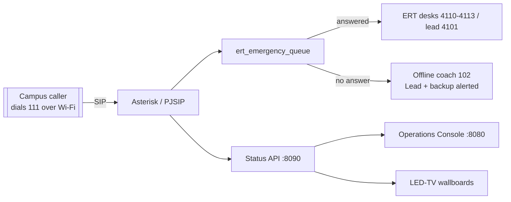

<div align="center">

# UPES-ECS — Campus Emergency Communication System

**One number. Every emergency. No internet required.**

[](https://github.com/rohanbatrain/UPES-ECS/actions/workflows/lint.yml)
[](https://github.com/rohanbatrain/UPES-ECS/actions/workflows/docs.yml)
[](https://rohanbatrain.github.io/UPES-ECS/docs/)
[](LICENSE)

</div>

UPES-ECS is a **LAN-only** campus emergency + internal calling system built on
Asterisk / PJSIP. It runs over campus Wi-Fi with **no internet, no SIM, and no
cloud**, so it keeps working when normal networks are down. Deploy it as a fixed
campus install **or** a self-powered disaster-response van with corner repeaters.

> **In an emergency, dial `111`.** That's the only thing students need to know.

---

## Quick start — one command on a new Windows PC

Copy this repo onto the PC (USB / `git clone`), open **PowerShell** at the repo root, and run:

```powershell
powershell -ExecutionPolicy Bypass -File .\Install-UpesEcs.ps1
```

That single script does **everything**: installs host prerequisites (OpenSSH, 7-Zip),
opens the SIP/RTP firewall (one UAC prompt), builds + boots the QEMU Asterisk PBX
(self-configures Asterisk, the dialplan, all accounts, the status API, fail2ban, nightly
backups), **generates the multilingual voice prompts** (neural Piper TTS — these are not
shipped in the repo, so clones stay lightweight), registers autostart (VM + Console at
every logon), generates the LED-TV name directory, and starts the **Operations Console**
on `:8080`. When it finishes, phones
register to the shown `LAN IP:5060` and dial **111** — and it all survives a reboot.
Internet is needed only for the first build.

```powershell
.\Install-UpesEcs.ps1 -LanIp 192.168.0.3 -LaunchTV   # pin phone-LAN IP + open both TV boards
.\Install-UpesEcs.ps1 -Rebuild                        # wipe & rebuild the VM disk
.\Install-UpesEcs.ps1 -Uninstall                      # stop VM + remove autostart/firewall
```

Paths are portable (default runtime dir `%USERPROFILE%\qemu`), so it works for any
Windows user — not just the machine it was authored on.

---

## Features

- **One-number hotline (`111`)** — the whole campus dials a single number; calls land in
  the ERT queue and are dispatched to the right responders.
- **ERT dispatch & escalation** — trained position logins (desk `4110–4113`, lead `4101`)
  answer, transfer, and escalate; unanswered `111` calls trigger a callback/chase workflow.
- **Offline panic-coach (`102`)** — automatic human-first fallback when no answer point is
  free; alerts the ERT Lead + backup in parallel, recorded from the first second.
- **Multilingual IVR** — per-caller voice-language routing with generated Piper TTS prompts;
  the Console and wallboards localize to the region language.
- **Live operations console + LED-TV wallboards** — a single-pane dashboard scaled to serve
  many concurrent screens, plus always-on safety and operations boards.
- **LAN-only by design** — an explicit infrastructure boundary; all emergency data stays
  on-premises, and no captured audio ever leaves the box.

## The system in one picture



- **Identity:** SAP ID = extension = username. Fixed answer points use `4xxx`.
- **Numbers:** `111` emergency · `102` offline coach · `199` drill · `700s` paging ·
  `9000s` conference · `*22/*23` on/off shift · `*45/*46` pause/resume.

---

## Documentation

🌐 **Landing page:** **<https://rohanbatrain.github.io/UPES-ECS/>** (HPE-styled, 44 languages)
📚 **Full documentation site:** **<https://rohanbatrain.github.io/UPES-ECS/docs/>** (MkDocs Material)

Jump straight to:

- **New to the project?** → [Docs home](docs/index.md)
- **Building it?** → [Day-1 quickstart](docs/getting-started/quickstart.md)
- **Planning it?** → [Master Implementation Plan](docs/operations/master-implementation-plan.md)
- **Architecture** → [System architecture](docs/architecture/system-architecture.md) ·
  [Call flows](docs/architecture/call-flows.md)
- **What could go wrong?** → [Risk register](docs/operations/risk-register.md)

Preview the site locally:

```bash
pip install -r docs/requirements.txt
mkdocs serve      # http://127.0.0.1:8000
```

---

## Operating it (day-to-day)

Everyday commands run in **PowerShell** on the PBX laptop, from the repo root.

**Add a person** — SAP ID = extension = username. Generates the secret **once**, pins it
in the single source of truth, pushes it live, and syncs the roster + callout groups + the
wallboard directory. **Idempotent — re-running never changes an existing password:**

```powershell
powershell -File deploy\qemu\Add-UpesUser.ps1 -SapId 500000005 -Name "Student Example Five"
# staff (8-digit) or explicit context:  -Role staff
# match a phone already configured:      -Secret <value>
```

Procedure + the rules that keep it from drifting:
[deploy/qemu/ADD-USER-RUNBOOK.md](deploy/qemu/ADD-USER-RUNBOOK.md).

**Open the always-on campus screens** (kiosk, one per monitor):

```powershell
powershell -File Console\Show-TV.ps1 -Both              # safety -> monitor 0, ops -> monitor 1
```

- Public safety board — `http://localhost:8080/tv-safety.html`
- Operations board — `http://localhost:8080/tv-ops.html`
- Operations Console — `http://localhost:8080`

**Moved to a new network?** Provision phones with the stable hostname **`upes-ecs.local`**
and there is nothing to do — an mDNS responder re-points the name at the laptop's current
LAN IP automatically. To force a server-side rebind, run `Set-UpesLanIp.ps1` or click
**Rebind** in the Console. Details: [deploy/qemu/HOSTNAME-mDNS.md](deploy/qemu/HOSTNAME-mDNS.md).

---

## Repository map

| Folder / file | What's in it |
|---|---|
| **`Install-UpesEcs.ps1`** | One-command setup for a new Windows PC — prereqs, PBX VM, autostart, Console, TV boards. |
| [deploy/qemu/](deploy/qemu/) | The real deployment: headless QEMU Asterisk server VM + build/lifecycle scripts, `Add-UpesUser.ps1`, `Set-UpesLanIp.ps1`. |
| [deploy/asterisk/](deploy/asterisk/) | Authoritative Asterisk config baked into the VM — dialplan, queues, RTP, fail2ban. Accounts are the single source of truth (`pjsip_accounts.example.conf`). |
| [api/](api/) | `upes_api.py` — FastAPI status/control service running inside the VM (`:8090`). |
| [Console/](Console/) | Operations Console (`:8080`), the two campus LED-TV wallboards, and `Show-TV.ps1`. |
| [config/](config/) | Emergency dialplan (`extensions_custom.conf`) + features + wiring. |
| [scripts/](scripts/) | In-VM helper scripts — incident IDs, missed-incident logging, health, retention, mass callout. |
| [provisioning/](provisioning/) | Roster CSV **templates** (`*.example.csv`) + Linphone provisioning profiles. |
| [i18n/](i18n/) | Translation catalogs + TTS voice generation for multilingual prompts. |
| [packaging/](packaging/) | Offline / fat-installer build machinery. |
| [docs/](docs/) | All narrative documentation (MkDocs) — architecture, features, guides, operations, reference. |
| `setup.sh` | Linux server bootstrap (native-Linux / van server path). |

> **Not in this repo (by design):** real rosters, SIP secrets, SSH keys, captured audio,
> and `secrets/TEAM-CREDENTIALS.md` are git-ignored and stay on the operator's machine.
> Ship sanitized `*.example.*` templates instead — see [SECURITY.md](SECURITY.md).

---

## Golden rules

1. **`111` is human-first** — never depends on AI, internet, or cellular; the offline coach
   (`102`) is the automatic fallback when no human answers.
2. **Unsure? Escalate.** Never drop an emergency call silently.
3. **Only `111`/`199` are recorded.** Student-to-student calls never are.
4. **Emergency controls are role-restricted** (paging, conference, recordings).
5. **Back up before every change.** Test with `199` before `111`.

---

## Contributing & security

- [Contributing guide](CONTRIBUTING.md) · [Code of Conduct](CODE_OF_CONDUCT.md)
- [Security policy](SECURITY.md) — **data-hygiene rules are hard requirements**
- Changes are gated by CI: Ruff, ShellCheck, PSScriptAnalyzer, gitleaks, markdownlint, and a
  strict MkDocs build.

## License

Released under the [MIT License](LICENSE). Copyright © 2026 Rohan Batra.
