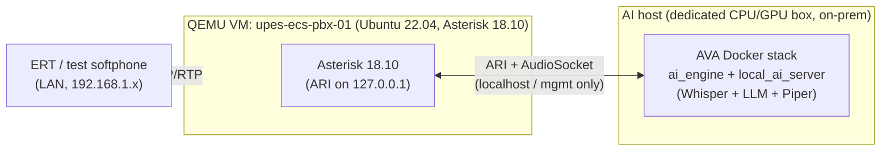

# AI-101 Deployment — Running AVA + a local LLM alongside the Asterisk VM

Deploys the AVA AI Voice Agent next to the existing UPES-ECS Asterisk stack (the QEMU VM
in [`../deploy/qemu/`](https://github.com/rohanbatrain/UPES-ECS/blob/main/deploy/qemu/README.md)) so extension **101** works, **without
touching the human-first 111 line**. Follows [SOP 19 §8–§10](design.md).

> ✅ Verified from AVA docs · ⚠️ Assumed / verify on our stack · 🔒 Locked by SOP 19.

---

## 1. Topology



**Principle 🔒:** AVA talks to Asterisk over **localhost / the management interface
only**. Nothing about 101 is exposed to the LAN except the dialplan extension itself.
**Nothing leaves the premises at all** — STT, LLM and TTS are all local (no cloud, no API
keys). 111 has **zero** new dependencies.

⚠️ **Where AVA runs — decide first (see [TODO.md](todo.md) step 1). Capacity, not wiring,
is the deciding factor:**

- **(a) Inside the same VM** — simplest wiring (ARI over `127.0.0.1`), **but not viable for
  the local models.** The VM runs **TCG (no hardware acceleration)**; even with WHPX and
  `-m 4096 -smp 4` it **cannot** run faster-whisper + an 8B LLM + Piper at real-time
  latency (~15s+ per turn — unusable on a live call). Fine only for wiring/smoke tests, not
  a working 101.
- **(b) A dedicated AI host on the mgmt segment (REQUIRED for a real 101)** — a box with a
  **real GPU (or a strong many-core CPU)**; ARI points at the VM's mgmt IP (still not
  student-facing). This is the **recommended and realistic** deployment. Target turn
  latency: GPU ~0.5–2s; CPU-only ~5–15s (marginal). Size VRAM/RAM to the chosen model
  (see [TODO.md](todo.md) §1).

Either way the dialplan (`Stasis(asterisk-ai-voice-agent)`) is identical.

---

## 2. Install AVA alongside the VM

✅ Requirements: **x86_64 Linux + Docker + Docker Compose v2**, Asterisk **18+ with ARI**
(our VM = 18.10 ✅), and — for real-time local inference — a **GPU (recommended) or strong
multi-core CPU** on the AVA host (§1 option b). ⚠️ Install a matching NVIDIA driver +
Container Toolkit if using a GPU.

```bash
# On the dedicated AI host (option b, recommended) — NOT the TCG VM:
ssh -i C:\Users\Rohan\qemu\ssh\upes_key -p 2222 ubuntu@localhost   # (VM shown; use the AI host for real deploys)

# 1. Docker (verify first) ⚠️
docker --version || curl -fsSL https://get.docker.com | sh
docker compose version
# GPU only: verify the NVIDIA Container Toolkit is installed so containers can see the GPU
nvidia-smi

# 2. Get AVA
git clone https://github.com/hkjarral/AVA-AI-Voice-Agent-for-Asterisk.git /opt/ava
cd /opt/ava

# 3. Guided setup + diagnostics (AVA CLI) ✅
agent setup            # interactive wizard: transport, LOCAL provider, ARI creds
agent check            # diagnostics: ARI reachable, transport, local models loaded

# 4. Pull the local LLM once (no internet needed thereafter for inference)
ollama pull qwen2.5:7b-instruct   # or llama3.1:8b-instruct — see TODO.md §1
# faster-whisper + Piper model files are fetched once into local_ai_server, then run offline
```

> ⚠️ Exact install steps (compose file names, whether `agent` is a wrapper script or an
> installed CLI) must be taken from AVA's own README at deploy time — do not assume beyond
> what is verified here.

### Asterisk side (one-time, does not affect 111)

- Enable **ARI** (`ari.conf`) with a dedicated user bound to **localhost/mgmt only**;
  ensure `http.conf` `bindaddr=127.0.0.1` (or mgmt IP for option b). ⚠️ Confirm current
  `ari.conf` state in the VM.
- Register the Stasis app name AVA uses: `asterisk-ai-voice-agent` ✅ (created implicitly
  when `ai_engine` connects; no static config needed beyond ARI being on).
- Add `ctx_ai_101`, `ctx_ai_196`, `ctx_ai_fallback` from
  [Integration-Plan §4](integration-plan.md#4-upes-ecs-dialplan-wiring) to
  [`../config/extensions_custom.conf`](https://github.com/rohanbatrain/UPES-ECS/blob/main/config/extensions_custom.conf). **Test order:**
  198 echo → 196 AI test → 101 → confirm 111 still works.

---

## 3. Secrets & local model management

🔒 **No LLM API keys exist in this design** — inference is entirely local, so there is no
cloud credential to leak. The **only** secret is the Asterisk ARI credential. It goes in
AVA's git-ignored **`.env`** ✅; nothing in this repo or in `config/*.yaml`.

```dotenv
# /opt/ava/.env   (chmod 600, git-ignored — DO NOT COMMIT)
# NO GEMINI / GOOGLE / OPENAI KEYS — the LLM, STT and TTS all run locally.
ASTERISK_ARI_USERNAME=ava
ASTERISK_ARI_PASSWORD=__strong_random__       # matches ari.conf; localhost/mgmt-scoped
```

- **ARI creds:** strong, random, **used only over localhost/mgmt**; rotate the VM's dev
  defaults per the [qemu hardening checklist](https://github.com/rohanbatrain/UPES-ECS/blob/main/deploy/qemu/README.md#production-hardening-checklist).
- **Local model management (replaces cloud key handling):**
  - **LLM:** `ollama pull <model>` once (e.g. `qwen2.5:7b-instruct` or
    `llama3.1:8b-instruct`); the model file lives on the AI host's disk. Point
    `config/ai-agent.local.yaml` at the local Ollama/llama.cpp endpoint (default
    `http://localhost:11434`), not any external URL.
  - **STT:** faster-whisper / Vosk model files fetched once into `local_ai_server`,
    then loaded offline.
  - **TTS:** Piper voice (`.onnx` + `.json`) placed on disk in `local_ai_server`.
  - Pin model versions/digests and back up the model files so a rebuild does not need
    internet. After first pull, the host can run **air-gapped**.
- Add `/opt/ava/.env`, `config/ai-agent.local.yaml` to `.gitignore` ✅ (AVA already
  ignores them; double-check in our repo copies).

---

## 4. Configure the 101 agent

In `config/ai-agent.local.yaml` (operator overrides, git-ignored) define agent slug
**`upes-ecs-101`**:

- **Pipeline = fully local** (`local_ai_server`): faster-whisper STT + Ollama/llama.cpp
  LLM + Piper TTS. No cloud provider, no keys — see
  [Integration-Plan §3.1](integration-plan.md#31-where-the-local-model-plugs-in-the-key-decision).
- **Transport:** AudioSocket (default) ✅.
- **System prompt:** the SOP 19 triage script + hard limits
  ([Integration-Plan §3.2](integration-plan.md#32-triage-system-prompt-lives-in-the-ava-agent-config)).
- **Tools:** enable **only** `transfer` (→ extension `111`) and a **post-call HTTP hook**
  to write `ai_*` fields. 🔒 **Do NOT enable** anything that could close/hang-up-instead-
  of-escalate, page, or mark false alarm.
- Validate: `agent config validate` ✅.

---

## 5. Health checks

Per [SOP 19 §9](design.md) — **separate from the 111 health check**. 101
health is Warning/Degraded when down (111 still Critical-gated on its own).

| Check | How | Pass = |
|---|---|---|
| AVA engine running | `docker compose ps` / `agent check` ✅ | `ai_engine` up |
| Reachable from Asterisk | `agent check` ARI probe; `asterisk -rx "ari show apps"` shows `asterisk-ai-voice-agent` | app registered |
| STT / LLM / TTS up (all local) | `agent check --local` ✅; `ollama ps` shows the model loaded | all green; model resident |
| GPU / host load OK | `nvidia-smi` (or CPU load); turn latency within budget | GPU ~0.5–2s, CPU-only ~5–15s |
| **196 internal AI test** | Call 196 from an ERT softphone; hear opening prompt, answer a mock scenario | AI answers + summarizes |
| **101 test call** | Call 101; verify triage + pre-brief | works end to end |
| **101 → 111 transfer** | Trigger an escalation phrase ("emergency"/"fainted") | caller lands in `ert_emergency_queue` |
| **Fallback to 111** | Stop AVA (`docker compose stop`), call 101 | plays `ai-unavailable`, routes to 111 |
| Response time | Observe first-token / turn latency; AVA `/metrics` (:15000) ✅ | within agreed budget |
| AI logs written | Incident store shows `ai_*` fields for the test incident | fields present |
| Summary generation | `ai_summary` populated + ERT-editable | pre-brief correct |
| **111 unaffected** | Call 111 with AVA both up and down | identical human flow both times |

Wire an AVA health probe into the existing UPES health-check script as a **101-only,
non-blocking** signal — it must never flip the 111/system status to Critical on its own
(SOP 19 §6: 101 AI failure = Warning/Degraded when 111 works).

---

## 6. Phased rollout

🔒 Follows [SOP 19 §10](design.md). **Do not skip stages.**

| Phase | Who | Extensions live | Gate to advance |
|---|---|---|---|
| **1** | — | 111 human-first only (**no AI**) | Already proven in the VM (call to 111 ANSWERED ✅). AI adds nothing here. |
| **1.5a** | IT / builder | **196** internal AI test; 199 drill | AVA up; 196 answers; **fallback to 111 proven**; `ai_*` logged. No students. |
| **1.5b** | **ERT only** | **101** in test mode for ERT/internal | ERT validate triage quality, escalation phrasing, pre-brief usefulness; Incident Commander approves prompt/routing (SOP 19 §7). |
| **2** | Students / staff | **101** included in student/staff role contexts | 🔒 **Requires:** the **dedicated AI host** provisioned with acceptable turn latency, ERT sign-off on triage quality, and the (already-local) privacy decision recorded ([Integration-Plan §3.3](integration-plan.md#33-privacy-decision-fully-local-audio-stays-on-campus)). No cloud approval needed — nothing leaves campus. |
| **3** | — | routing, dashboard summaries, analytics, approved integrations | Post-pilot. |

**Kill switch 🔒:** ERT Lead / Incident Commander can **disable 101** at any time (SOP 19
§7) by removing `include => ctx_ai_101` from the role contexts (or stopping the AVA stack)
— callers then simply get 111. Document this one-liner in the ERT runbook.

---

## 7. What must NOT change

- 🔒 111 keeps working with AVA **stopped, deleted, or never installed**. Verify by running
  the 111 call test with the AVA containers down.
- 🔒 **No cloud / no LLM API keys anywhere** — STT, LLM and TTS stay local; nothing (audio,
  transcript, or summary) ever leaves the premises. This applies to 101 as much as 111.
- 🔒 ARI/AVA reachable on **localhost/mgmt only**, never the student LAN.
- 🔒 Secrets never committed; recordings/logs retention stays under
  [SOP 12 §7](../operations/incident-logging-schema.md).
