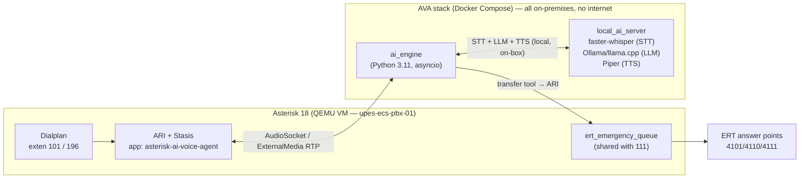
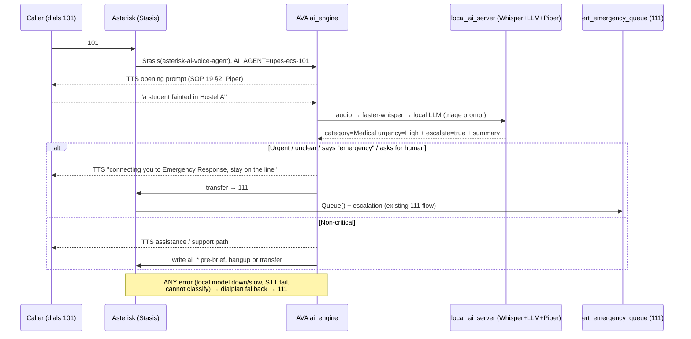

# AI-101 Integration Plan — AVA + a fully-local LLM on UPES-ECS Asterisk

How the **AVA AI Voice Agent** is wired onto the existing UPES-ECS Asterisk stack to
provide extension **101** (AI triage), and how it obeys [SOP 19](../SOP/19-AI-101-Design.md)
and [SOP 12](../SOP/12-Incident-Logging-Schema.md).

> **Legend:** ✅ **Verified** from AVA's public README/docs · ⚠️ **Assumed / to-verify on
> our stack** · 🔒 **Locked** by SOP 19 (must not change).

---

## 1. AVA architecture summary

AVA is an MIT-licensed AI voice agent for Asterisk/FreePBX. ✅ Runtime = **Python 3.11+**,
shipped as a **Docker Compose** stack of two containers:

- **`ai_engine`** — the orchestrator. Connects to Asterisk over **ARI**, receives calls
  via a **Stasis** application, streams call audio, runs the **STT → LLM → TTS** pipeline,
  and drives call control (answer, play, **transfer**, hangup) through ARI + tool-calling.
- **`local_ai_server`** — hosts the local STT/LLM/TTS models (Vosk / faster-whisper,
  Ollama / llama.cpp, Piper / Kokoro) for the on-prem pipeline. **Required** for the
  UPES-ECS local-first design: the whole STT→LLM→TTS pipeline runs here with zero
  internet, so audio never leaves the premises (see §3.3).

✅ **Config hierarchy** (three files):

| File | Role | Git |
|---|---|---|
| `config/ai-agent.yaml` | Upstream "golden baseline" defaults | tracked |
| `config/ai-agent.local.yaml` | **Our** operator overrides (deep-merged at startup) | git-ignored |
| `.env` | Asterisk ARI creds + secrets (**no LLM API keys — inference is local**) | git-ignored |

✅ **Agent selection** is per-call via dialplan channel variables: `AI_AGENT` (agent slug)
and optional `AI_PROVIDER` (override the pipeline for that call). ✅ AVA ships **golden
baseline** pipelines including a **fully-local** one — **"Local — faster-whisper STT +
Ollama/llama.cpp LLM + Piper TTS, everything on-premises"** — which is the one we use.
✅ Admin UI at `http://localhost:3003`;
CLI `agent setup|check|dialplan|config validate`; optional Prometheus `/metrics` on port 15000.



---

## 2. How AVA hooks Asterisk

### 2.1 Transport — how audio reaches the AI ✅

AVA supports two media transports, both bidirectional:

| Mode | Notes | Recommendation for us |
|---|---|---|
| **AudioSocket** | AVA's **default** (`config/ai-agent.yaml`). TCP audio socket per call. | **Start here** — fewer moving parts, no RTP port juggling. |
| **ExternalMedia RTP** | Asterisk `externalMedia` channel streams RTP to the engine. | Fallback if AudioSocket has codec/latency issues. Note our VM already pins RTP to `10000-10019` ([qemu README](../deploy/qemu/README.md)); ExternalMedia would need its own port plan. |

Our VM runs **Asterisk 18.10** ✅ which satisfies AVA's **Asterisk 18+ / ARI** requirement.

### 2.2 Control plane — ARI + Stasis ✅

The call enters AVA when the dialplan executes `Stasis(asterisk-ai-voice-agent)`. The
`ai_engine` receives the `StasisStart` event over ARI (WebSocket), owns the channel for
the duration of triage, and issues ARI commands (playback via TTS, and the **`transfer`**
tool) to move the caller onward. ARI credentials come from `.env`
(`ASTERISK_ARI_USERNAME` / `ASTERISK_ARI_PASSWORD`) ✅.

> 🔒 **Design contract:** AVA must be able to `transfer` the caller into the **existing**
> `ert_emergency_queue` / `ctx_emergency_111` path — the same one 111 uses. We do **not**
> build a parallel human-response path for 101; escalation is the human 111 flow.

⚠️ **To verify:** AVA's `transfer` tool is documented for "extensions, queues, ring
groups". We must confirm it can target our Asterisk **queue/context** cleanly, or whether
we transfer to a **dialplan extension** (e.g. `111`) that then does `Queue(...)`. The
dialplan in §4 is written so **either** works — AVA transfers to extension `111`
(or a dedicated `esc-111`), and the dialplan does the queue/escalation. This keeps the
human escalation logic in Asterisk, not in AVA. **Recommended.**

---

## 3. The local STT → LLM → TTS pipeline

### 3.1 Where the local model plugs in (the key decision)

🔒 **No cloud AI.** The triage brain is a **local LLM** served on-prem via **Ollama** or
**llama.cpp** (e.g. a small instruct model such as **Llama 3.x 8B** or **Qwen2.5 7B**).
The full pipeline — STT, reasoning, TTS — runs inside `local_ai_server` on the campus/van
with **zero internet, no API keys**. Audio never leaves the premises.

| Stage | Component (local) | Runs in | Notes |
|---|---|---|---|
| **STT** | **faster-whisper** (or **Vosk**) | `local_ai_server` | On-prem transcription; faster-whisper for accuracy, Vosk for the lightest CPU footprint. |
| **Reasoning / triage** | **Local LLM via Ollama / llama.cpp** (Llama 3.x 8B / Qwen2.5 7B instruct) | `local_ai_server` | Model files on disk, pulled once; no keys, no egress. |
| **TTS** | **Piper** | `local_ai_server` | On-prem neural voice; fully offline. |

**The whole path is on-box.** There is exactly one shape and it is local: `caller audio →
faster-whisper → local LLM → Piper → caller`. This is the core architectural lever: *the
LLM is a swappable **local** pipeline stage inside AVA; Asterisk never talks to any cloud,
and neither does AVA.* Swapping the model (e.g. Qwen ↔ Llama, or a larger quant) is only a
`config/ai-agent.local.yaml` + `ollama pull` change — the **same dialplan** either way.

> ⚠️ **Hardware reality (state honestly).** faster-whisper + an 8B-class LLM + Piper need
> real CPU/GPU. The current van VM is **QEMU with TCG (no hardware acceleration)** and
> **cannot** run these models in real time (~15s+ per turn — unusable on a live call). So
> 101 realistically needs a **dedicated GPU box / capable host**, not the current laptop
> VM. See [deployment.md §1](deployment.md#1-topology). Rough turn latency: **local
> CPU-only ~5–15s** (marginal), **local GPU ~0.5–2s** (usable).



### 3.2 Triage system prompt (lives in the AVA agent config)

The local-LLM agent is configured (in `ai-agent.local.yaml`, agent slug `upes-ecs-101`)
with a system prompt that encodes SOP 19 verbatim behaviour:

- **Opening** (SOP 19 §2): *"You have reached the UPES-ECS AI Emergency Assistant. If this
  is an immediate emergency, say emergency or dial 111 at any time. Please tell me what
  happened and where you are located."*
- **Collect:** what happened, where, injury/danger, are you safe, can you stay on line,
  name / SAP ID. Build the structured pre-brief (SOP 19 §4).
- **Escalation prompt:** *"This sounds urgent. I am connecting you to UPES Emergency
  Response now. Please stay on the line."* → call `transfer` tool → `111`.
- **Failure prompt** (played by dialplan, not the LLM — see §4): *"The AI Emergency
  Assistant is currently unavailable. Connecting you to UPES Emergency Response now."*
- 🔒 **Hard limits in the prompt (SOP 19 §5):** never diagnose, never say "false alarm",
  never tell the caller it is *not* an emergency, never promise dispatch, never delay —
  when in doubt, escalate. The prompt is **defence-in-depth only**; the real guarantee is
  the dialplan fallback (§4) and the fact that we **do not wire** any AVA tool that could
  close an incident, page campus, or reject a call.

### 3.3 Privacy decision — fully local, audio stays on campus 🔒

> **DECISION (per SOP 19 §8): the stack is LOCAL-FIRST — no cloud AI.** STT, LLM and TTS
> all run on-prem in `local_ai_server`. **Raw emergency call audio never leaves the
> premises**, and no transcript, summary, or any caller data is sent to any third party.
> This **exceeds** SOP 19 §8's preferred posture ("keep emergency audio local/on-campus
> unless UPES explicitly approves cloud AI") — no cloud approval is needed because there is
> no cloud.

**Why this is the stronger posture:**

- 🔒 **Zero cloud egress.** No API keys, no internet dependency for inference. Nothing to
  leak, nothing to review with a cloud vendor, no data-handling terms to negotiate.
- 🔒 **111 is fully independent** — it never touches AI or the internet. If the AI host is
  unavailable, 111 works unchanged.
- 101 **falls back to 111** on any failure, so the AI host is never a safety dependence.
- The rollout still runs **196 internal-only** first (staff/ERT, no student PII), then a
  limited **101 test for ERT**, then students — but the privacy gate is already satisfied
  by design; the remaining gates are AI **quality** and **host capacity**, not egress.

**Points to record in the decision:**

- The only secrets are **ARI credentials** (localhost/mgmt-scoped); there are **no LLM API
  keys** to manage — see [deployment.md §3](deployment.md#3-secrets--local-model-management).
- Incident **recordings** remain the Asterisk-side WAVs governed by
  [SOP 12 §7](../SOP/12-Incident-Logging-Schema.md) retention — unchanged.
- ⚠️ **Prerequisite, not a privacy risk:** a **capable AI host (dedicated CPU/GPU box)** is
  required for real-time performance. The current TCG VM cannot run the local models at
  usable latency — see §3.1 and [deployment.md §1](deployment.md#1-topology).

---

## 4. UPES-ECS dialplan wiring

Add to [`../config/extensions_custom.conf`](../config/extensions_custom.conf). Two new
contexts (`ctx_ai_101`, `ctx_ai_196`) plus a shared **hard-fallback** target. **101 and
196 do the AI; escalation and failure both land on the existing 111 path** — the human
logic in `ctx_emergency_111` / `ctx_escalation` is unchanged.

```asterisk
; ==================================================================
; AI EMERGENCY ASSISTANT — 101   (AVA + LOCAL LLM triage; ALWAYS falls back to 111)
; ==================================================================
[ctx_ai_101]
exten => 101,1,NoOp(AI_101_CALL from ${CALLERID(num)})
 same => n,Set(CDR(userfield)=AI_101_CALL)
 same => n,Set(__SOURCE_NUMBER=101)
 same => n,Set(__INCIDENT_ID=${FILTER(A-Z0-9\-,${SHELL(${UPES_BIN}/incident_id.sh)})})
 same => n,Set(CDR(accountcode)=${INCIDENT_ID})
 same => n,Answer()
 same => n,Set(MIXMONITOR_FILENAME=${UPES_REC_DIR}/${INCIDENT_ID}_${CALLERID(num)}_${STRFTIME(${EPOCH},,%Y%m%d-%H%M%S)}.wav)
 same => n,MixMonitor(${MIXMONITOR_FILENAME})              ; record whole call, same as 111
 same => n,Set(AI_AGENT=upes-ecs-101)                      ; AVA agent slug
 same => n,Stasis(asterisk-ai-voice-agent)                 ; hand call to AVA (ai_engine via ARI)
 ; --- Control returns here ONLY if Stasis exits without a completed transfer ---
 same => n,Goto(ctx_ai_fallback,s,1)                       ; AVA errored / declined / hung up early -> 111
 same => n,Hangup()

; If Stasis() cannot even start (AVA engine down / ARI unreachable), Asterisk sets
; STASISSTATUS=FAILED and continues to the next priority -> fallback. Defence in depth:
exten => 101,n,NoOp(unreachable-guard)                     ; documentation marker

; ==================================================================
; INTERNAL AI TEST — 196   (staff/ERT only; NEVER students; test mode)
; ==================================================================
[ctx_ai_196]
exten => 196,1,NoOp(AI_196_TEST from ${CALLERID(num)})
 same => n,Set(CDR(userfield)=AI_196_TEST)
 same => n,Answer()
 same => n,Set(AI_AGENT=upes-ecs-101)                      ; same agent, test flag set in AVA config
 same => n,Set(AI_PROVIDER=test)                           ; optional per-call pipeline override
 same => n,Stasis(asterisk-ai-voice-agent)
 same => n,Goto(ctx_ai_fallback,s,1)                       ; even the test line falls back to 111 on error
 same => n,Hangup()

; ==================================================================
; HARD FALLBACK TO 111  (SOP 19 §6 — never a single point of failure)
; Reached on: Stasis failed/returned, AVA down, STT fail, "cannot classify",
; caller asked for a human, or any unhandled error.
; ==================================================================
[ctx_ai_fallback]
exten => s,1,NoOp(AI fallback -> 111 for ${INCIDENT_ID} status=${STASISSTATUS})
 same => n,Set(CDR(userfield)=AI_101_FALLBACK_TO_111)
 same => n,System(${UPES_BIN}/ai_incident.sh "${INCIDENT_ID}" "${CALLERID(num)}" fallback "AI unavailable/declined; auto-routed to 111")
 same => n,Playback(upes-ecs/ai-unavailable)               ; SOP 19 failure prompt
 same => n,Goto(ctx_emergency_111,111,1)                   ; EXACT human 111 flow (queue + escalation + missed-record)
 same => n,Hangup()
```

**Wiring notes**

- ⚠️ **`transfer` target.** AVA's `transfer` tool (agent config) points at extension
  **`111`**, i.e. `Goto(ctx_emergency_111,111,1)` semantics. That routes an urgent 101
  call into the **same** `ert_emergency_queue` + `ctx_escalation` chain 111 uses. We keep
  the human logic in Asterisk, not in AVA — confirm AVA can `transfer` to a dialplan
  extension (expected ✅) and that the transferred channel still carries `INCIDENT_ID`
  (⚠️ verify; if not, `ctx_emergency_111` already mints one).
- 🔒 **Fallback is Asterisk-native**, not AVA-native. Even if the whole AVA stack is dead,
  `Stasis()` failing lets the dialplan continue straight to `ctx_ai_fallback` → 111. The
  AI is never in the critical path for reaching a human.
- **196** uses the same agent but a `test` flag/provider so it can be exercised without
  touching the real 111 queue in a disruptive way — yet it *still* falls back to 111 on
  error (we never build a code path that can strand a caller).
- Role contexts: `include => ctx_ai_196` only in **`ctx_staff` / `ctx_ert`** (not
  `ctx_student`). `include => ctx_ai_101` is added to student/staff contexts **only at
  Phase 2** rollout; during Phase 1.5 only ERT/test extensions include it.
- Prompt files `upes-ecs/ai-unavailable` (and any AI prompts) recorded per
  [SOP 28](../SOP/28-Voice-Prompt-Scripts.md), same sounds dir as the 111 prompts.

---

## 5. Incident logging (`ai_*` fields)

Every 101 call is an incident, same as 111 ([SOP 12 §1](../SOP/12-Incident-Logging-Schema.md)),
with `source_number = 101` and the **additional AI fields** from
[SOP 12 §5](../SOP/12-Incident-Logging-Schema.md#5-ai-assisted-101-additional-fields):

```text
source_number = 101        ai_triage_enabled = true
ai_detected_location       ai_detected_category      ai_urgency_hint
ai_summary                 ai_questions_completed
transferred_to_111 (t/f)   transfer_time             human_responder_answered (t/f)
human_override (t/f)
```

**How they get written (AVA does not natively know our schema — ⚠️ we bridge it):**

1. The dialplan mints `INCIDENT_ID` and records the WAV **before** `Stasis()` (above), so
   an incident exists even if AVA dies mid-call.
2. AVA's local-LLM agent produces the structured pre-brief (SOP 19 §4). We capture it one
   of two ways — pick during build ([TODO.md](TODO.md)):
   - **AVA post-call webhook / `send_email_summary`-style HTTP tool** ✅ (AVA supports
     pre/in/post-call HTTP tools) → a small UPES endpoint writes `ai_summary`,
     `ai_detected_category`, `ai_detected_location`, `ai_urgency_hint`,
     `ai_questions_completed` into the incident store keyed by `INCIDENT_ID`.
   - Or AVA sets ARI **channel variables** before transfer, and an `h`-extension /
     `ai_incident.sh` writes them (mirrors the existing `missed_incident.sh` pattern).
3. `transferred_to_111`, `transfer_time`, `human_responder_answered`, `human_override`
   are set by the **Asterisk** side (the transfer into `ctx_emergency_111` / queue events),
   not by the AI — so they are trustworthy even if the AI summary is wrong.
4. 🔒 **The AI summary is a pre-brief only** — ERT can override
   (`human_override = true`). **AI can never close an incident** (SOP 12 §5, SOP 19 §5):
   no AVA tool with close/false-alarm/page capability is configured.

---

## 6. Safety / fallback matrix

Mirrors [SOP 19 §5–§6](../SOP/19-AI-101-Design.md). 🔒 = locked behaviour.

| Situation | 101 / AVA behaviour | Enforced by | Severity (SOP 19 §6) |
|---|---|---|---|
| Medical / injury / unconscious | 🔒 escalate to 111 | local-LLM prompt **+** transfer to 111 | — |
| Violence / threat / harassment | 🔒 escalate to 111 | prompt + transfer | — |
| Fire / smoke / accident | 🔒 escalate to 111 | prompt + transfer | — |
| Security / hostel / infrastructure danger | 🔒 escalate to 111 | prompt + transfer | — |
| Panic / caller says "emergency" | 🔒 immediate transfer to 111 | prompt + transfer | — |
| **Caller asks for a human** | 🔒 transfer to 111, no argument | prompt + transfer | — |
| AI cannot understand / cannot classify / unsure | 🔒 escalate to 111 (when in doubt, escalate) | prompt + transfer | Warning/Degraded |
| **AVA engine down / ARI unreachable** | 🔒 `Stasis()` fails → dialplan → `ctx_ai_fallback` → 111 | **Asterisk dialplan** (no AI needed) | Warning/Degraded (111 works) |
| Local LLM host down / too slow / STT fails | 🔒 AVA errors out of Stasis → fallback → 111 | dialplan fallback | Warning/Degraded |
| Non-critical, clearly understood | assistance log / approved support path; pre-brief written | agent config | — |
| **Transfer to 111 fails** | 🔒 create **critical missed AI emergency** record + alert ERT/control room | `ctx_emergency_111` → `ctx_escalation` → `ctx_emergency_vm` + `missed_incident.sh` | **Critical for the AI feature** |
| AI tries to close / reject / false-alarm / page | **impossible** — no such tool wired; only `transfer`/collect/summarize | absence of capability | 🔒 hard limit |
| 111 itself | **never depends on AI**; unchanged human-first flow | separate context | 111 failure = **Critical** |

**Defence in depth = three independent layers:** (1) the local-LLM system prompt tells it
to escalate; (2) the Asterisk dialplan forces fallback to 111 regardless of what AVA does;
(3) AVA is configured **without** any dangerous tool. Any single layer failing still
lands the caller on the human 111 line.

---

## 7. Open questions to verify on our stack ⚠️

1. Docker availability inside the QEMU Ubuntu VM (AVA needs Docker Compose) — see
   [deployment.md §2](deployment.md#2-install-ava-alongside-the-vm).
2. Exact `local_ai_server` config keys / model IDs for the Ollama (or llama.cpp) LLM,
   faster-whisper STT, and Piper TTS in AVA's local baseline.
3. Whether AVA's `transfer` cleanly hits a dialplan extension (`111`) vs a queue, and
   whether `INCIDENT_ID` survives the transfer.
4. AudioSocket vs ExternalMedia latency with 8 kHz μ-law on our G.711 setup.
5. The exact post-call hook / channel-var mechanism to populate the `ai_*` fields.
6. **Host capacity (the big one).** The local Whisper + 8B LLM + Piper pipeline needs a
   **dedicated CPU/GPU box** for real-time turns (GPU ~0.5–2s; CPU-only ~5–15s, marginal).
   The current van VM runs on **TCG (no HW accel)** and **cannot** do this in real time —
   WHPX alone is not enough for an 8B model. Decide the AI host (option b in
   [deployment.md §1](deployment.md#1-topology)) and size VRAM/RAM before Phase 1.5b.
