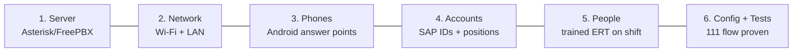

# UPES-ECS — Bare-Minimum Operational Checklist

The **least** you need to be genuinely operational — i.e. a student can dial **111**,
an ERT officer answers on a real device, the call is recorded, and an unanswered call
becomes a reviewable incident. Two columns: **Minimum** (must have to go live) and
**Recommended** (do this for a real, resilient pilot).

> Rule of thumb: if any **Minimum** box is unchecked, you are **not** operational.

---

## The 6 pillars



---

## 1. Server (the PBX)

| # | Item | Minimum | Recommended |
|---|---|---|---|
| 1.1 | Machine | 1× mini-PC / server (or the van PBX) | Dedicated, in a locked room/rack |
| 1.2 | OS | Ubuntu Server LTS / Debian stable | Same + auto-security-updates |
| 1.3 | PBX software | Asterisk 18+ / FreePBX (free) | FreePBX GUI for admin |
| 1.4 | Static IP | **Mandatory** — assigned + recorded | + local DNS `pbx.upes.lan` |
| 1.5 | Storage | Enough for recordings/logs (tens of GB) | Separate disk/partition for recordings |
| 1.6 | **Power** | **UPS on the PBX** (emergency system!) | UPS on PBX + switch + router + key APs |

> ⚑ Power is not optional for a *disaster* system. Minimum = UPS on the server so a
> brief outage doesn't kill 111. The van solves this with autonomous power.

---

## 2. Network

| # | Item | Minimum | Recommended |
|---|---|---|---|
| 2.1 | Wi-Fi AP | 1× AP covering the pilot area | APs covering all target zones |
| 2.2 | Switch + router | 1× each, LAN reachable to PBX | PoE switch + voice VLAN |
| 2.3 | **Client isolation** | **OFF** (or SIP/RTP allowed to PBX) | Voice-enabled SSID/VLAN |
| 2.4 | Firewall | SIP/RTP allowed **LAN-only**; no public exposure | + guest Wi-Fi blocked from PBX |
| 2.5 | Quality | Two-way audio works in pilot area | < 150 ms latency, < 1% loss |

---

## 3. Phones (answer points + callers)

| # | Item | Minimum | Recommended |
|---|---|---|---|
| 3.1 | ERT answer points | **3× dedicated Androids** (ERT Lead 4101 + 2 operators 4110/4111) | 4–5 (add reserve + Control) |
| 3.2 | Answer-point care | On charger, battery-optimization OFF, screen-lock off | Wall-mounted, labelled per position |
| 3.3 | Responder devices | — (Medical/Security can start as dispatch-by-mobile) | Medical 4200 + Security 4300 Androids |
| 3.4 | Caller devices | Pilot users install Linphone on their own phones | 10–25 pilot users onboarded |
| 3.5 | App | **Linphone** (Android) | + MicroSIP for any Windows desk |

---

## 4. Accounts & identity

| # | Item | Minimum | Recommended |
|---|---|---|---|
| 4.1 | Responder positions | `4101`, `4110`, `4111` provisioned + registered | + `4112`, `4113`, `4120`, `4200`, `4300` |
| 4.2 | Pilot user accounts | ~10 SAP-ID accounts ([pilot-users.csv](https://github.com/rohanbatrain/UPES-ECS/blob/main/provisioning/pilot-users.csv)) | 10–25 |
| 4.3 | Secrets | Unique, ≥12-char random per account | + delivered once, securely; stored in secrets store |
| 4.4 | Roles/contexts | ERT positions in `ctx_ert`/`ctx_ert_lead`; users in `ctx_student`/`ctx_staff` | + `ctx_responder` for Medical/Security |
| 4.5 | Anonymous SIP | **Disabled**; guest Wi-Fi blocked | + fail2ban |

---

## 5. People & process

| # | Item | Minimum | Recommended |
|---|---|---|---|
| 5.1 | ERT on shift | **2 operators available** + 1 Lead reachable | 3+ operators, Lead + reserves |
| 5.2 | Shift roster | Who holds each position, per shift ([SOP 30](../operations/ert-roles-and-shifts.md)) | + handover log signed |
| 5.3 | IT admin | 1 who can run the PBX | 1 + a trained **backup** (bus factor) |
| 5.4 | Training | ERT know the answer script + dispatch ([SOP 02](../operations/ert-sop.md)) | Full [Training Plan](../operations/training-plan.md) + a drill |
| 5.5 | Desk references | [ERT SOP](../operations/ert-sop.md) + [Quick-Cards](../reference/quick-cards.md) printed | + numbering + drill SOP |

---

## 6. Config, prompts & the go-live test

| # | Item | Minimum | Recommended |
|---|---|---|---|
| 6.1 | Emergency dialplan | 111 → queue → coach-in-parallel + background alert → voicemail live ([config](https://github.com/rohanbatrain/UPES-ECS/blob/main/config/)) | + paging/conference/dispatch |
| 6.2 | Recording | 111 recorded whole-call; files land + link to incident | + retention cron ([SOP 13](../operations/recording-retention.md)) |
| 6.3 | Incident logging | Missed 111 → Missed Emergency Incident | + full incident schema ([SOP 12](../operations/incident-logging-schema.md)) |
| 6.4 | Prompts | `emergency-preanswer`, `emergency-voicemail-prompt`, `drill-prompt` recorded | all prompts ([SOP 28](../reference/voice-prompt-scripts.md)) |
| 6.5 | Health check | `upes-ecs-healthcheck.sh` runs, reports READY | + local dashboard |
| 6.6 | Backup | One tested config backup taken | daily + pre-change + tested restore ([SOP 11](../guides/backup-restore.md)) |
| 6.7 | Drill line | **199** works, no real dispatch | + drill schedule |

---

## Go-live gate — these MUST pass ([SOP 17](../operations/pilot-test-plan.md) / [32](../operations/test-evidence-sheet.md))

- [ ] A registered softphone **dials 111 → an ERT Android rings → answered**.
- [ ] The call produces a **recording** linked to an incident ID.
- [ ] **Unanswered 111 → coach-in-parallel + background alert → voicemail → Missed Emergency Incident** (critical, pending).
- [ ] **199 drill** runs with **no** real dispatch.
- [ ] Student-to-student call works and is **not** recorded.
- [ ] Health check reports **READY** (≥2 ERT positions available).
- [ ] A **config backup** exists and restore was tested once.

> A failed **111 / 199** test or a **recording failure** is a **do-not-go-live** condition.

---

## Absolute-minimum shopping list (if you have nothing but the network)

```text
1 × mini-PC/server (Ubuntu)          + 1 × UPS
3 × dedicated Android phones         + 3 × chargers/wall mounts   (ERT answer points)
   (use existing router/switch/AP)
Free software: Asterisk/FreePBX, Linphone, this repo's config/scripts
People: 2 trained ERT operators + 1 Lead + 1 IT admin (per shift)
```

That, plus the config in [../config/](https://github.com/rohanbatrain/UPES-ECS/blob/main/config/) and the [runbook](deployment-runbook.md),
is enough to answer real emergencies on 111. Everything else is resilience and reach.

Full itemized kit (campus + van, minimum + recommended): [05-Bill-of-Materials.md](bill-of-materials.md).
