# UPES-ECS — Call Flows

Every call type on UPES-ECS, as sequence and flow diagrams with short narration.
This is the *runtime* companion to [02-System-Architecture.md](system-architecture.md)
(the static build) and the operational [ERT SOP](../operations/ert-sop.md). Diagrams are
Mermaid with an ASCII fallback for the primary flow.

> **Golden rules that shape every flow below.** 111 is **human-first** — no AI,
> internet, or cellular in its path. **Unsure → escalate** and keep the caller on the
> line. **Only 111 and 199** are recorded end-to-end. **Emergency controls
> (paging, conference, escalation) are role-restricted** by dialplan context.
>
> **Disaster-ready additions.** The campus learns **one number: 111**. `101` (local-first AI)
> and `102` (offline coach) are internal routes the *system* invokes — a caller is **never**
> told to hang up and redial. When no human answers, the caller is **coached immediately
> and in parallel** with the system still trying to reach a responder — never left in
> silence. Every fallback path works with **zero internet and zero AI service** (offline
> TTS coach); the richer **local-first AI (101)** only *upgrades* this when the local AI stack is available.

---

## 0. Number → route map

Every dialable number and what it does. Authoritative source: [Numbering Plan](../reference/numbering-plan.md).

| Dialed | Name | Route / behaviour | Recorded? | Who may dial |
|---|---|---|---|---|
| **111** | Emergency Hotline *(primary)* | Record + incident ID → `ert_emergency_queue` (press **1** any time → first-aid) → on no-answer: background responder alert **in parallel with** offline panic-coach → retry / voicemail → Missed Incident | ✅ whole call | anyone |
| **102** | Offline panic-coach | Deterministic first-aid guidance (CPR / bleeding / choking / fire / lockdown / recovery / trapped), **zero internet, zero AI service**. The automatic fallback beneath 111; also a direct-dial for testing | ✅ (as 111) | auto-fallback · dial = test |
| **101** | AI triage *(local-first, planned)* | Conversational **local-first AI** (on-device Ollama/llama.cpp + Whisper + Piper — **no cloud, no Gemini**) that **rides** a 111 call — gives a spoken pre-brief to the ERT, escalates urgent cases to humans, and **falls back to the 102 coach** when the AI is unavailable. It is a capability the system invokes, **never a number a caller dials** | (as 111 on handoff) | auto · rides 111 |
| **199** | Drill / Test | Simulates 111 flow, isolated, `DRILL-ONLY`, **no real dispatch** | ✅ marked drill | any authenticated user |
| **198** | Echo test | Plays caller's own audio back (mic/speaker/network check) | ❌ | anyone |
| **196** | AI test *(later)* | Exercises AI pipeline only | ❌ | test roles |
| **700** | All-campus paging | Live broadcast to every zone — **PIN + ERT Lead** | ❌ (attempt logged) | ERT Lead only |
| **701–705** | Zone paging | Academic / Hostels / Security-gates / Medical-ERT / Admin-ops | ❌ (attempt logged) | ERT Lead / zone-authorized |
| **9000** | Main Incident Command | ConfBridge, **recorded when active**, PIN | ✅ when active | ERT + responder roles |
| **9001–9004** | Side coordination rooms | Security / Medical / Warden / Ops bridges, PIN | ❌ by default | role-scoped |
| **`*45` / `*46`** | Pause / resume in queue | Self-service queue toggle | — | ERT members |
| **SAP ID** | Person-to-person | Direct call between users; **normal, not recorded** | ❌ | per context |
| **4101 / 4110–4113 / 4120** | ERT Lead / Operators / Control | Dispatch/escalation targets; Operators + Control answer the queue | — | internal |
| **4200 / 4300 / 4400 / 4500 / 4600** | Medical / Security / Warden / Ops / IT | Dispatch targets (`ctx_responder`) — **not** queue answerers | — | internal |
| **4700s** | Fixed devices | Speakers / gate phones (`ctx_fixed_device`) | — | fixed |

---

## 1. 111 — happy path

Caller dials 111; the call is recorded and given an incident ID *before* it rings
anyone, so nothing is ever lost. The queue ring-alls every available ERT Operator
position; the first to answer owns the incident, classifies it, and dispatches.

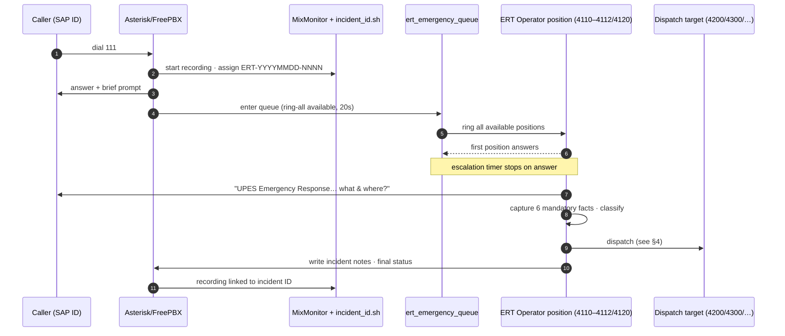

**ASCII fallback (primary flow)**

```text
Caller ─dial 111─► Asterisk ─► [record + incident ID assigned FIRST]
                                   │
                                   ▼
                        ert_emergency_queue  (ring-all available ERT, 20s)
                                   │ first position answers  → timer stops
                                   ▼
                        ERT Operator: opening line → 6 facts → classify
                                   │
                                   ▼
                        dispatch (target 4200/4300/…) → log → recording linked
```

- Recording covers the **whole call**, not just the bridged segment (MixMonitor).
- "Healthy" queue = **≥ 2 available** positions ([Drill SOP §4](../operations/drill-test-sop.md)).
- Six mandatory facts and the opening line: [ERT SOP Part A](../operations/ert-sop.md).

---

## 2. 111 — no responder → coach in parallel with reaching a human (disaster-ready)

**Design principle (grounded in Emergency Medical Dispatch practice):** a distressed
caller must never sit in silence and must never be told to hang up and dial another
number. The old serial ring-out (queue → Lead 20s → backup 20s → *then* voicemail) could
leave a caller ~45–60s with no guidance before the one window that matters — so it was
replaced. Now, the moment the queue times out, the system does **two things at once**:

1. **Alerts the ERT Lead + backup in the background** (non-blocking Asterisk call-files,
   `alert_responders.sh`) — their phones ring with a spoken alert and a "press 1 to join
   the emergency queue" option. This never holds the caller.
2. **Immediately begins coaching** the caller through the **offline panic-coach**
   (`ctx_ai_helpline`) — a deterministic first-aid decision tree (CPR / bleeding / choking
   / fire / lockdown / recovery / trapped), and logs a **Missed Emergency Incident** at once
   (severity critical, never auto-closed) so a human calls back regardless.

Meanwhile the caller can **press 1 at any time during the queue** to jump straight to
first-aid without waiting the queue out (fast-path, `ctx_111_fastpath`). Inside the coach,
**9 = retry a responder** (re-queues and bridges whoever has since become free) and
**8 = leave a message** → emergency voicemail. Nothing is ever a dead end, and every path
works with **no internet and no AI service**.

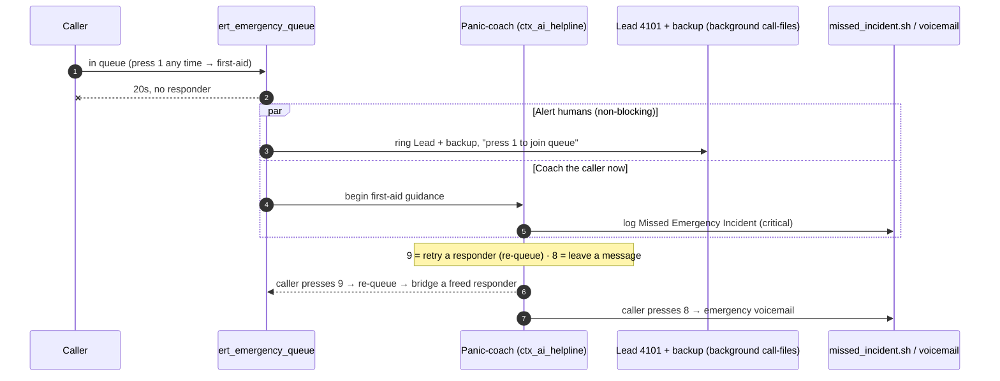

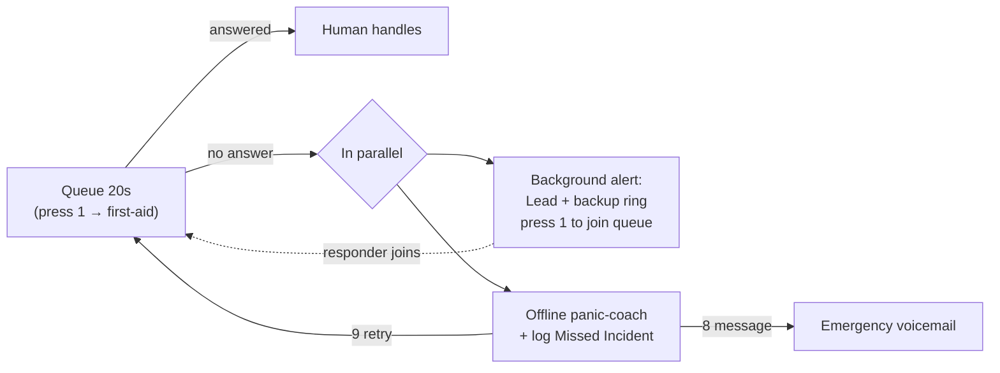

- The coach + prompts: [`../config/extensions_aihelpline.conf`](https://github.com/rohanbatrain/UPES-ECS/blob/main/config/extensions_aihelpline.conf),
  [`../scripts/gen-coach-prompts.sh`](https://github.com/rohanbatrain/UPES-ECS/blob/main/scripts/gen-coach-prompts.sh) (offline TTS).
- Background responder alert: [`../scripts/alert_responders.sh`](https://github.com/rohanbatrain/UPES-ECS/blob/main/scripts/alert_responders.sh).
- Review workflow (listen → identify → **call back** → dispatch/close): [ERT SOP Part F](../operations/ert-sop.md).
- EMD grounding (stay-on-line pre-arrival instructions; no redial loops): see [Journal/Feature-Roadmap.md](../project/roadmap.md) and the SOP 19 fallback matrix.

---

## 3. 199 — drill / test (isolated, DRILL-ONLY)

199 exercises the *same shape* as 111 so the mechanism is proven, but it is **walled
off from real dispatch**. Every artifact is stamped `DRILL-ONLY` so a drill can never
be mistaken for a real event.

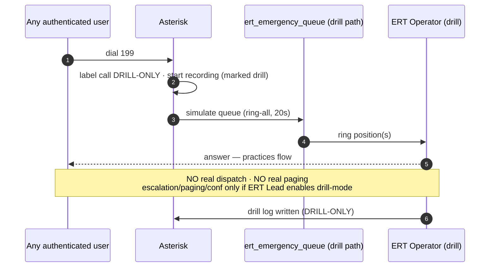

- Any authenticated user may self-test with 199; whether it exercises escalation/paging/conference is **ERT-Lead-controlled drill mode** ([Drill SOP §1](../operations/drill-test-sop.md)).
- Guardrails (never casually use 111, never surprise-page, never leave a simulated miss unreviewed): [Drill SOP §7](../operations/drill-test-sop.md).

---

## 4. Dispatch — warm transfer & three-way bridge

The default is **dispatch-without-transfer** (keep the caller, separately call the
team). Two other modes exist; **blind transfer is discouraged** because it drops
ownership. The Operator stays **Incident Owner** until a handoff is confirmed.

### 4a. Warm transfer — responder must speak to the caller directly

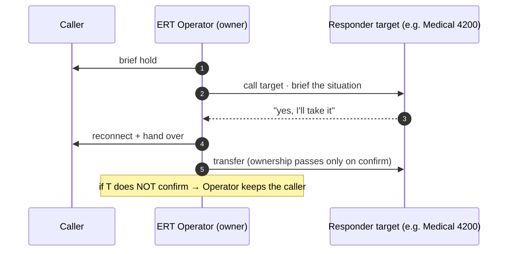

### 4b. Three-way bridge — serious / unclear / vague location

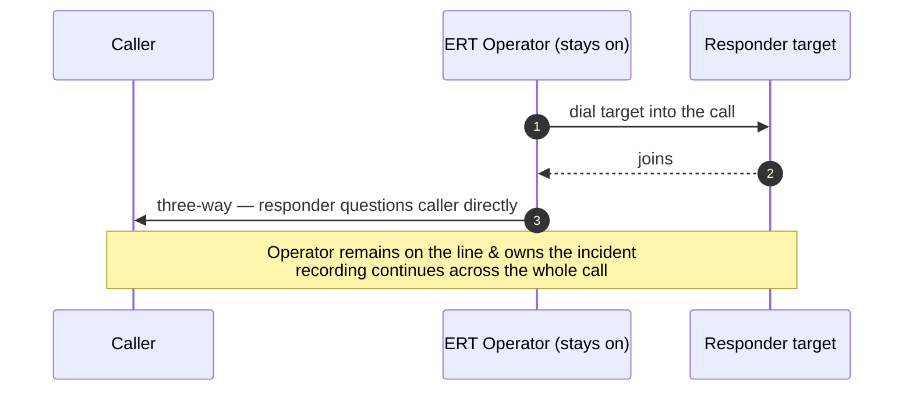

| Mode | When | Ownership |
|---|---|---|
| Dispatch w/o transfer *(default)* | Help can be sent without caller talking to the team | Operator keeps it |
| **Warm transfer** | Responder must talk to the caller | Passes **on confirm** only |
| **Three-way bridge** | Serious / unclear / location vague | Operator stays & owns |
| ~~Blind transfer~~ | — | **Discouraged** (drops ownership) |

Full dispatch decision tree and quick-guide: [ERT SOP Part C](../operations/ert-sop.md).

---

## 5. Silent-call protocol

A 111 that connects but is **silent, whispering, or sounds like distress** is treated
as a **real critical emergency** — never a wrong number. The call already carries the
caller's SAP ID (and location, if from a fixed device).

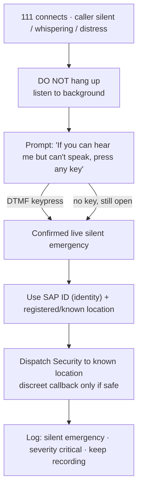

- One number by design: someone hiding from a threat only has to remember **111** — there is deliberately no separate silent line to choose under pressure.
- Full protocol: [ERT SOP Part I](../operations/ert-sop.md).

---

## 6. Paging a zone (700 with PIN)

Paging is a live one-way broadcast to fixed/shared devices. It is **role-restricted**;
all-campus **700 requires a PIN** and ERT Lead approval. Every attempt — allowed **and**
denied — is logged.

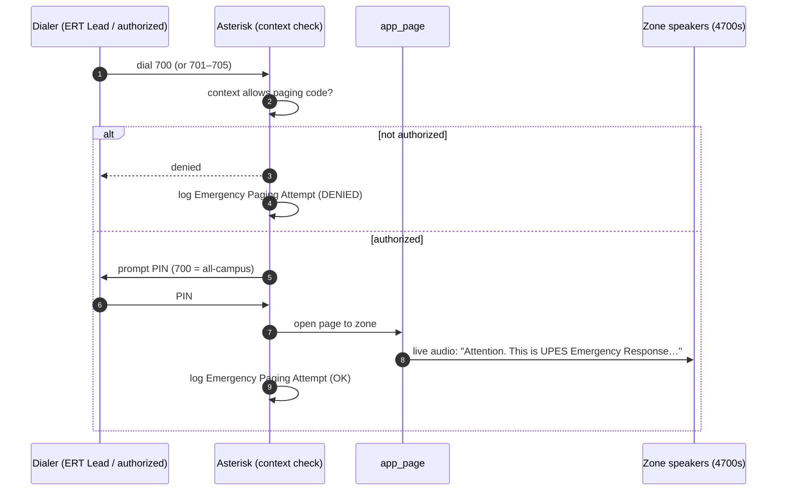

- Zones: 700 all-campus, 701 academic, 702 hostels, 703 security gates, 704 medical/ERT, 705 admin/ops ([Numbering Plan §4](../reference/numbering-plan.md)).
- Students/general staff are **blocked** from all paging codes; drill pages are prefixed *"Drill, drill, drill."* with prior notice.
- Message template and "use with care" rules: [ERT SOP Part D](../operations/ert-sop.md).

---

## 7. Conference 9000 activation

9000 is the Main Incident Command Room — opened **only** for multi-team incidents or
when the ERT Lead needs live coordination. It is **recorded when active** and PIN-gated.

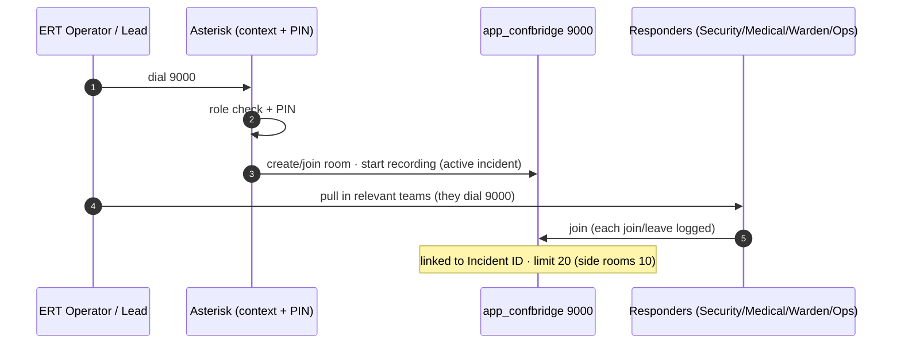

- Side rooms 9001–9004 (Security / Medical / Warden / Ops) are **not recorded** by default.
- "Do not open 9000 for every call": [ERT SOP Part E](../operations/ert-sop.md). Surge posture (broadcast first, pull coordination into 9000): [ERT SOP Part J](../operations/ert-sop.md).

---

## 8. Student-to-student (normal call, not recorded)

Person-to-person calls by SAP ID are ordinary internal calls. They are **not recorded**
and get no incident ID — recording/logging is reserved for 111/199. Reachability is
governed by context (`ctx_student` / `ctx_staff`).

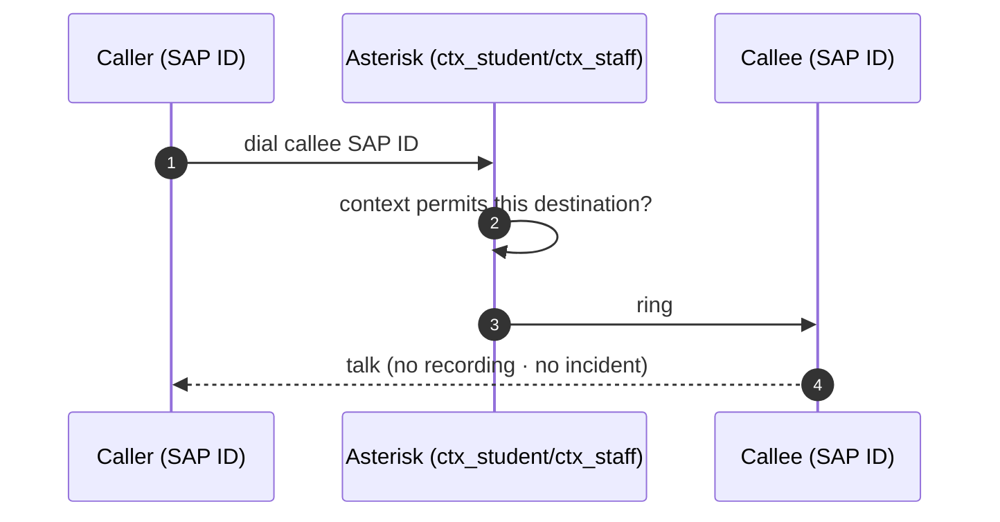

- Privacy by design: student calls stay private; only emergency traffic is recorded ([Architecture §7](system-architecture.md)).

---

## 9. 101 — AI assistant (future, always falls back to 111)

101 is a **later** phase and never sits in the 111 path. The AI triages, but on any
urgency, uncertainty, or failure it **escalates or falls back to 111** — the human-first
line. 196 is its isolated test line.

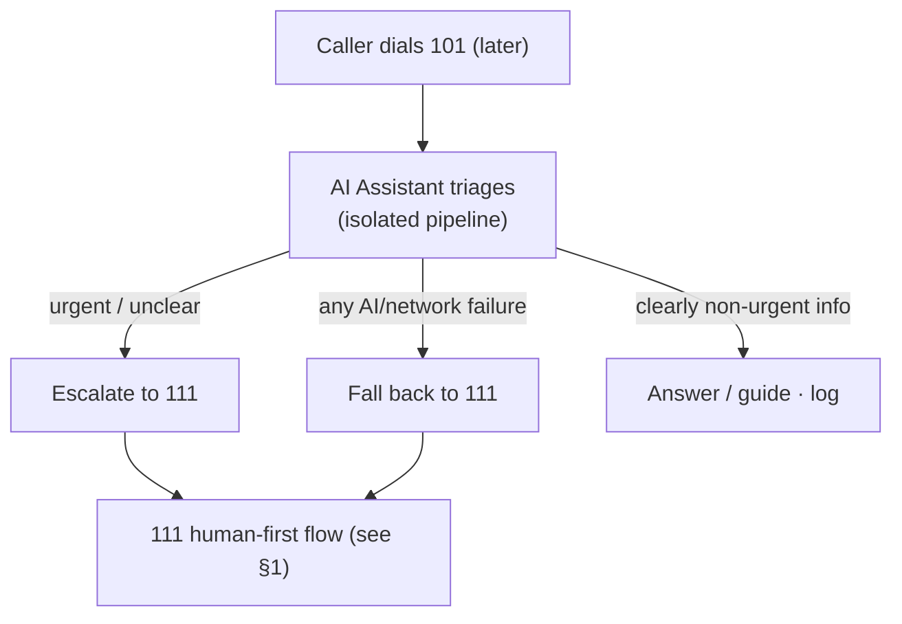

```mermaid
sequenceDiagram
    autonumber
    participant C as Caller
    participant AI as 101 AI Assistant (future)
    participant H as 111 human-first path

    C->>AI: dial 101
    AI->>AI: triage
    alt urgent / unclear / failure
        AI->>H: hand off to 111 (recorded human flow)
    else non-urgent
        AI->>C: assist · log
    end
    Note over AI,H: 111 never depends on AI; AI never blocks 111
```

- **Do not** alias 101 to 111 — 101 is reserved for the AI ([Numbering Plan §1](../reference/numbering-plan.md)).
- Design principle: 111 is human-first and AI always falls back to it ([Architecture §7](system-architecture.md)).

---

## Cross-references

- Static architecture behind these flows → [02-System-Architecture.md](system-architecture.md)
- Where recordings/incidents/logs live → [06-Numbering-and-Data-Map.md](numbering-and-data-map.md)
- Network paths these calls traverse → [04-Network-and-Deployment.md](network-and-deployment.md)
- Operate the flows → [ERT SOP](../operations/ert-sop.md) · [Drill SOP](../operations/drill-test-sop.md)
