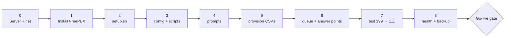

# UPES-ECS Deployment Runbook

The single **ordered, zero-to-operational** runbook. It ties together the pieces that
already exist — it does **not** rewrite them. Each phase points to the authoritative doc
or script. Work top-to-bottom; **tick every box**; test after each phase.

> **Definition of operational:** a registered softphone dials **111**, an ERT Android
> rings and answers, the call is recorded and linked to an incident ID, and an unanswered
> 111 becomes a Missed Emergency Incident — plus **199** drill works with no real dispatch.

---

## Phase map



---

## Validate on a spare node FIRST (optional but proven)

The whole flow has already been **run and validated** off-server — do the same before
touching the production box ([deploy/README.md](../deploy/README.md)).

- [ ] **Docker (config/dialplan validation)** — real Asterisk 18 on the current node:
  ```bash
  cd deploy
  docker compose up -d --build
  docker exec upes-ecs-asterisk asterisk -rx "dialplan reload"
  ```
  Proven: all contexts load, `ert_emergency_queue` built from positions `4110/4111/4112`,
  a 111 call ran the whole chain (incident ID → MixMonitor → escalation → voicemail →
  Missed Incident), 199 isolated as `DRILL-ONLY`, health check honestly reports CRITICAL
  with 0 registered responders.
- [ ] **WSL2 (real SIP registration + RTP audio)** — the last-mile audio proof:
  ```bash
  wsl -d Ubuntu-22.04 -u root -- bash /mnt/c/Users/Rohan/UPES/deploy/wsl-setup.sh
  wsl -d Ubuntu-22.04 -u root -- bash /mnt/c/Users/Rohan/UPES/deploy/wsl-rtp-proof.sh
  ```
  Proven: SIP `200 OK` + bound contact, 111 answered, **576 RTP packets in 12 s**, a real
  **11.56 s WAV (RMS 0.047)** named `ERT-…_1001_….wav`. (This test caught + fixed the
  `MixMonitor(…,b)` bridge-only bug — recording now captures the whole call.)

> Windows Docker NAT can't carry RTP — registration + two-way audio are validated in WSL2
> or on the real Linux server/van with host networking.

---

## Phase 0 — Server & network  ([SOP 08 §0](../SOP/08-FreePBX-Build-Guide.md), [SOP 15](../SOP/15-Local-Infrastructure-Diagram.md))

- [ ] Provision the server: Ubuntu Server LTS / Debian stable, hostname **`upes-ecs-pbx-01`**.
- [ ] Assign a **static IP** (record IP / subnet / gateway — **TBD**, collect from UPES IT).
- [ ] Local DNS: resolve `pbx.upes.lan` and `sip.upes.lan` to that IP (or document the IP fallback).
- [ ] Router / switch / AP powered and LAN-reachable to the PBX (models **TBD**).
- [ ] **Wi-Fi client isolation OFF** (or a voice VLAN allowing SIP/RTP to the PBX); SSID **TBD**.
- [ ] Firewall: SIP UDP **5060** + RTP UDP **10000–20000** allowed **LAN-only**; **no public exposure**.
- [ ] **UPS on the PBX** (minimum). Power is not optional for a disaster system.

**Exit:** server reachable on its static IP; a Wi-Fi client can ping the PBX.

---

## Phase 1 — Install FreePBX  ([SOP 08 §0.1–0.3](../SOP/08-FreePBX-Build-Guide.md))

- [ ] Install FreePBX (official distro, or `freepbx` on Asterisk 18+/20+).
- [ ] Apply all updates in **Admin → Module Admin**.
- [ ] **Settings → Asterisk SIP Settings:** driver **PJSIP (chan_pjsip)**, bind UDP 5060 on the LAN interface only; RTP range 10000–20000; leave external/NAT empty (LAN-only); set Local Networks = campus subnets.
- [ ] **Allow Anonymous Inbound SIP = No** · **Allow SIP Guests = No**.
- [ ] Lock the **FreePBX Admin GUI** to the management subnet — **never** student Wi-Fi.

**Test:** create two temp extensions, register two Androids (Linphone) on Wi-Fi, call each
other, and dial **198** (echo). ✅ when both work.

---

## Phase 2 — Bootstrap with setup.sh  ([setup.sh](../setup.sh))

From the repo root on the server, as root:

```bash
sudo ./setup.sh
```

Idempotent. It: creates `/opt/upes-ecs` + `/var/lib/upes-ecs/{incidents,alerts,security,paging,conference,retention}`
and the recordings dir; installs the helper scripts; sets `asterisk:asterisk` ownership so
`System()` can write; backs up any existing `extensions_custom.conf`; installs the cron jobs
(health check every 5 min, retention cleanup daily 03:30); and checks `func_shell`.

- [ ] `setup.sh` completes without errors.
- [ ] Helper scripts present + executable in `/opt/upes-ecs/`.
- [ ] `func_shell` reported present (needed for `${SHELL()}` incident IDs) — else enable it or replace the `incident_id.sh` call ([config/README.md](../config/README.md)).

---

## Phase 3 — Config + scripts  ([config/README.md](../config/README.md), [SOP 09](../SOP/09-Dialplan-Design.md))

- [ ] Review/merge `config/extensions_custom.conf` into `/etc/asterisk/` (setup.sh does **not** auto-overwrite an existing file — diff and merge):
  ```bash
  diff /etc/asterisk/extensions_custom.conf config/extensions_custom.conf
  ```
- [ ] Confirm the recordings dir exists + is `asterisk`-owned: `/var/spool/asterisk/monitor/upes-ecs/`.
- [ ] Reload: `asterisk -rx 'dialplan reload'`.
- [ ] Contexts present: `ctx_emergency_111`, `ctx_ai_helpline` (offline panic-coach / 102), `ctx_111_fastpath` (press-1 first-aid), `ctx_emergency_vm`, `ctx_drill_199`, and role contexts `ctx_student/staff/ert/ert_lead/responder/control_room/fixed_device/admin`.

---

## Phase 4 — Record the prompts  ([SOP 28](../SOP/28-Voice-Prompt-Scripts.md))

Drop recorded WAVs into `/var/lib/asterisk/sounds/en/upes-ecs/`:

- [ ] `emergency-preanswer` — "You have reached UPES Emergency Response. Your emergency call may be recorded. Please stay on the line."
- [ ] `emergency-voicemail-prompt`
- [ ] `drill-prompt` — "This is a UPES-ECS drill call. No real emergency response will be dispatched."
- [ ] `queue-paused` / `queue-resumed` / `not-authorized` (short confirmations).

---

## Phase 5 — Provision accounts from CSVs  ([provisioning/README.md](../provisioning/README.md), [SOP 14](../SOP/14-Device-Provisioning-Sheet.md))

Committed CSVs carry `__SET_ON_IMPORT__` in the secret column — **never** real secrets in
git. Fill secrets into a **throwaway** file, import, then **delete** it.

- [ ] Align template columns to your FreePBX Bulk Handler export headers first.
- [ ] Take a config backup (pre-change rule).
- [ ] Fill secrets into a throwaway `.filled.csv`:
  ```bash
  awk -F, 'BEGIN{OFS=","} NR==1{print;next}{ "openssl rand -base64 15"|getline s; $3=s; print }' \
      provisioning/pilot-users.csv > provisioning/pilot-users.filled.csv
  ```
- [ ] **Bulk Handler → Extensions → Import** the `.filled.csv`; review the preview; Import → **Apply Config**.
- [ ] Repeat for `responder-positions.csv` (positions `4101/4110/…`, `ctx_ert`/`ctx_responder`) and `fixed-devices.csv` (`4700s`, `ctx_fixed_device`).
- [ ] **Delete every `.filled.csv`** and deliver secrets once, securely.
- [ ] **Confirm each person's account context** (9-digit → `ctx_student`, 8-digit → `ctx_staff`) — do **not** put a person's SAP ID into a responder context; positions are staffed by shift.

Confirmed people (real roster only): `40000001` Staff Member One, `40000002` Staff Member Two,
`40000003` Staff Member Three, `500120597` Rohan Batra ([SOP 30](../SOP/30-ERT-Roles-and-Shifts.md)).

---

## Phase 6 — Queue + responder answer points  ([SOP 08 §1.4–1.6](../SOP/08-FreePBX-Build-Guide.md))

- [ ] **Create `ert_emergency_queue`** — ring strategy `ringall`, agent timeout 20s, skip-busy Yes, **no MoH** (emergency hold announcement instead); allow a queued caller to **press 1** → offline first-aid (`ctx_111_fastpath`); fail-over → coach-in-parallel flow (below).
- [ ] **Unanswered-call flow (coach-in-parallel, replaces the old serial ring-out):** when no answer point is free, the caller goes **straight to the offline panic-coach** (102, `ctx_ai_helpline`) with **no dead-air**, **while** call-files alert **ERT Lead 4101 + backup** (Security 4300 + Medical 4200 + Warden/Admin) in the **background** ("press 1 to join the queue"). In the coach, **9 = retry a responder**, **8 = leave a message** → **Emergency Voicemail** (60s) → **Missed Emergency Incident** (Critical, Pending Review).
- [ ] **Provision the dedicated Androids** per position: Linphone as `4101` (ERT Lead), `4110`/`4111`/`4112` (Operators), reserve `4113`; on charger, **battery-optimization OFF**, screen-lock off, labelled per position ([SOP 24](../SOP/24-Mobile-App-Reliability-and-Battery.md)).
- [ ] Add the ERT operator positions + reserve `4113` as **queue agents**.
- [ ] Route **111** (Custom Destination → `ctx_emergency_111`): MixMonitor starts → pre-answer prompt → `ert_emergency_queue`. Ensure 111 is reachable from **every** context.
- [ ] Clone to **199** (`ctx_drill_199`): drill prompt, test target only, tag `DRILL-ONLY` — **no** real escalation/dispatch.

---

## Phase 7 — Test 199 then 111  ([SOP 17](../SOP/17-Pilot-Test-Plan.md), [SOP 32](../SOP/32-Test-Evidence-Sheet.md))

Always test the **drill line first**.

- [ ] **199** → drill prompt → no real dispatch → `DRILL-ONLY` appears in CDR/recording.
- [ ] **111** from a registered student softphone → an ERT Android rings → answered → a recording file appears under `/var/spool/asterisk/monitor/upes-ecs/`, named `ERT-…_SAPID_….wav`.
- [ ] Leave **111 unanswered** → caller is coached by the offline panic-coach (102) **while** Lead + backup are alerted in the background → **8 = Emergency Voicemail** → **Missed Emergency Incident** (severity Critical, Pending Review).
- [ ] **SAP-ID → SAP-ID** call works and is **not** recorded; caller ID shows `Name - SAP ID`.
- [ ] A student is **denied** paging/conference (Access Denied Event logged).

---

## Phase 8 — Health check + backup  ([SOP 10](../SOP/10-Health-Monitoring-Checklist.md), [SOP 11](../SOP/11-Backup-Restore-Procedure.md))

- [ ] Run the health check:
  ```bash
  sudo /opt/upes-ecs/upes-ecs-healthcheck.sh
  ```
  Reports **READY** only with ≥2 available ERT responders (it honestly reports CRITICAL otherwise).
- [ ] Confirm `/var/lib/upes-ecs/health.txt` updates on the 5-min cron.
- [ ] Take a config backup **and** commit custom config to the `upes-ecs-config` git repo (secrets excluded).
- [ ] **Test a restore once** (backup you haven't restored is a hope, not a backup).

---

## Go-live gate — these MUST pass  ([SOP 17](../SOP/17-Pilot-Test-Plan.md) / [SOP 32](../SOP/32-Test-Evidence-Sheet.md) / [SOP 18](../SOP/18-Go-Live-Checklist.md))

- [ ] Registered softphone **dials 111 → an ERT Android rings → answered**.
- [ ] The call produces a **recording** linked to an incident ID.
- [ ] **Unanswered 111 → coach-in-parallel + background alert → voicemail → Missed Emergency Incident**.
- [ ] **199 drill** runs with **no** real dispatch.
- [ ] Student-to-student call works and is **not** recorded.
- [ ] Health check reports **READY** (≥2 ERT positions available).
- [ ] A **config backup** exists and restore was tested once.

> A failed **111 / 199** test or a **recording failure** is a **do-not-go-live** condition.

---

## Post-go-live & modes

- **Layer on later:** responder Androids (`4200`/`4300`), paging (700–705), conference
  (9000–9004), the AI 101 path, and the van drill — via the
  [Master Plan](../SOP/07-Master-Implementation-Plan.md).
- **Mode B (van):** the same config runs on the van PBX for disaster ops **and** as
  campus-PBX failover — pre-stage it synced with campus ([SOP 23](../SOP/23-Mobile-Van-Deployment.md)).
- **Ongoing:** health check on cron, retention cleanup daily 03:30, the **`upes-api`**
  service on **`:8090`** (LAN-only incident/health API), and backups 30 daily + 12
  weekly. Full itemized kit: [05-Bill-of-Materials.md](05-Bill-of-Materials.md); every
  number + data location: [06-Numbering-and-Data-Map.md](06-Numbering-and-Data-Map.md).

> **TBD before scale-out:** server IP/subnet, Wi-Fi SSID + client-isolation status,
> router/switch/AP models, final roster/locations, van power sizing, and the university's
> final retention policy.
