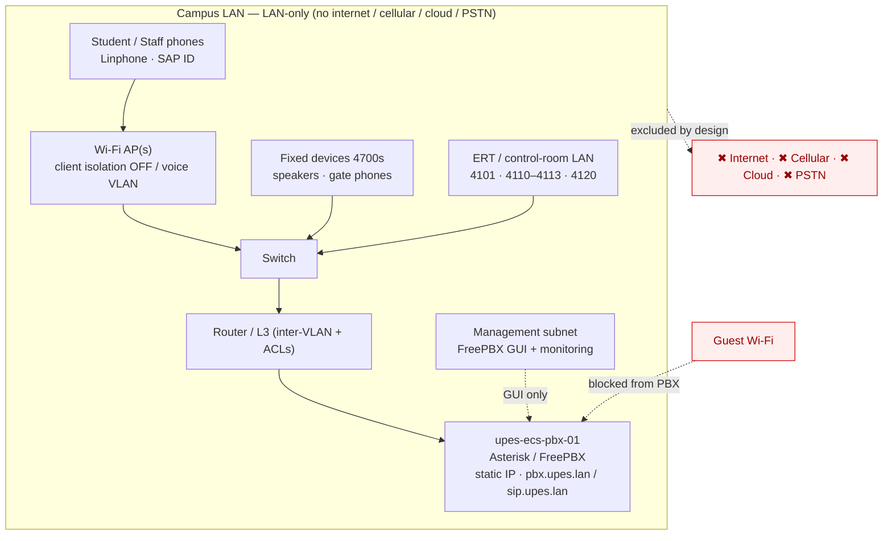
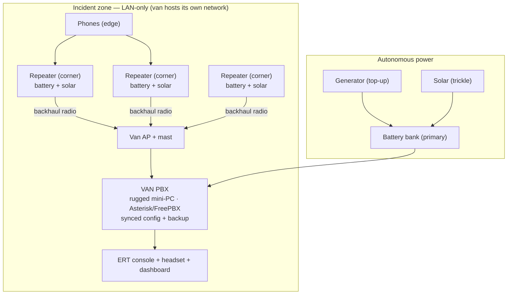
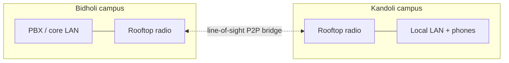
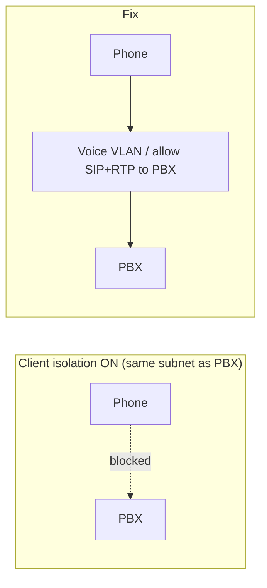

# UPES-ECS — Network & Deployment Topology

How UPES-ECS is wired and where it can run. This is the network companion to
[02-System-Architecture.md](02-System-Architecture.md) and the deep version of the
[Local Infrastructure Diagram](../SOP/15-Local-Infrastructure-Diagram.md). Everything
here is **LAN-only** — no internet, cellular, cloud, PSTN, or SIP trunk anywhere in the
path. Diagrams are Mermaid with an ASCII fallback for the primary topology.

> **Design boundary.** The PBX only ever binds to the LAN. SIP (5060/udp) and RTP
> (10000–20000/udp) are LAN-only; the FreePBX GUI lives on the management subnet only;
> guest Wi-Fi is blocked from the PBX; everything else is denied. There is **no public
> SIP/RTP exposure** — by design, not by firewall accident.

---

## 1. Campus network topology (Mode A)

Phones ride campus Wi-Fi to an AP, through a switch and router, to the PBX. Subnets
segment who can reach what; the management subnet (FreePBX GUI) is isolated from
student Wi-Fi, and guest Wi-Fi cannot see the PBX at all.



**ASCII fallback (primary topology)**

```text
 Student/Staff phones (Linphone, SAP ID)
        │  Wi-Fi
        ▼
   [ Wi-Fi AP ]  ── client isolation OFF (or voice VLAN)
        │
   [ Switch ] ──── Fixed devices 4700s (speakers, gate phones)
        │      └── ERT / control-room LAN (4101, 4110–4113, 4120)
        │
   [ Router / L3 ] ── inter-VLAN routing + ACLs
        │
   [ upes-ecs-pbx-01 ]  static IP · pbx.upes.lan / sip.upes.lan
        │
   Management subnet ── FreePBX GUI + monitoring (NEVER student Wi-Fi)

   Guest Wi-Fi ✖ blocked from PBX      ✖ no internet/cellular/cloud/PSTN
```

### Subnets / segments

| Segment | Contains | Access to PBX |
|---|---|---|
| Student Wi-Fi | Student phones | SIP/RTP **only** |
| Staff Wi-Fi | Staff / faculty phones | SIP/RTP |
| ERT / control-room LAN | 4101, 4110–4113, 4120 answer points | Full emergency device access |
| Fixed-device LAN/VLAN | 4700s speakers, gate phones (static IPs) | SIP/RTP |
| Management / admin subnet | FreePBX GUI, monitoring, AMI/ARI | GUI + admin — **never** from student Wi-Fi |
| **Guest Wi-Fi** | Visitors | **Blocked** (no PBX reachability) |

VLAN/QoS is optional for the first pilot and recommended later; a dedicated **voice
VLAN** for ERT/fixed devices is the clean way to satisfy client-isolation (§5) and
prioritise emergency media. See [Security Hardening §2](../SOP/26-Security-Hardening.md).

---

## 2. Van + repeater topology (Mode B)

When campus power/infra is down, the PBX rides in a **self-powered van**, extended by
**corner repeaters** on a single roaming SSID. Same UPES-ECS config, same numbers, same
SOP. The van also doubles as **failover** for the campus PBX.



- Single SSID across all repeaters → phones roam seamlessly toward the van; overlapping coverage so one dead repeater degrades, not kills, coverage.
- Uplink stays **LAN-only** — the van hosts its own local network; 111 works with no internet.
- Each repeater + backhaul link is a **critical device** on the Health Dashboard.
- Full deployment SOP, readiness checklist, and power math: [Mobile Van Deployment](../SOP/23-Mobile-Van-Deployment.md).

---

## 3. Multi-campus wireless bridge (later)

A **later** phase links Bidholi and Kandoli with a rooftop **point-to-point wireless
bridge** (same backhaul tech family as the van repeaters). Out of scope for Phase 1.



Detail and design: [Multi-Campus Wireless](../SOP/20-Multi-Campus-Wireless.md).

---

## 4. Ports & firewall

Minimal surface, LAN-only, default-deny. No rule permits the public internet anywhere.

| Service | Port / range | Proto | Bind / allowed from | Denied |
|---|---|---|---|---|
| SIP signalling (PJSIP) | **5060** | UDP | LAN interface only; approved subnets (student/staff Wi-Fi, ERT/fixed LAN) | Public internet · guest Wi-Fi |
| RTP media | **10000–20000** | UDP | LAN only; approved subnets | Public internet · guest Wi-Fi |
| FreePBX admin GUI | 80/443 (HTTP/S) | TCP | **Management subnet only** | Student Wi-Fi · everything else |
| AMI / ARI | 5038 / 8088 | TCP | localhost / management subnet, strong creds | Public · student Wi-Fi |
| SSH (admin) | 22 | TCP | Management subnet only | Public · student Wi-Fi |
| Everything else | — | — | — | **Denied (default)** |

- `allowguest=no`, no anonymous endpoint; **fail2ban** Asterisk jail bans repeated failed auth; per-account concurrent-call limits protect the 111 queue. See [Security Hardening §1–5](../SOP/26-Security-Hardening.md).
- Media confidentiality (TLS/SIP + SRTP) is a **planned** hardening item, not yet enabled — [Security Hardening §4](../SOP/26-Security-Hardening.md).

---

## 5. Wi-Fi client isolation — the one setting that silently breaks everything

Many campus/guest Wi-Fi networks enable **client isolation** (a.k.a. AP/station
isolation), which stops one wireless client from talking to another **on the same
subnet**. The PBX is reachable across subnets via the router, so this often looks fine —
until it isn't.



**Fixes (pick one):**
1. Put the PBX on a **different subnet** reached via the router (isolation is intra-subnet), and allow SIP/RTP through the ACL — the common working setup.
2. Add an **explicit allow** so Wi-Fi clients can reach the PBX IP on 5060/udp + 10000–20000/udp even with isolation on.
3. Move voice devices to a **dedicated voice SSID/VLAN** with isolation off.

**Always** keep guest Wi-Fi isolated *and* blocked from the PBX. Verify with a real SIP
registration + a 199 call over Wi-Fi before relying on the system ([Drill SOP §4](../SOP/03-Drill-Test-SOP.md)).

---

## 6. Addressing & naming

| Item | Value |
|---|---|
| Hostname | `upes-ecs-pbx-01` |
| OS | Ubuntu Server LTS / Debian stable |
| IP | **Static — mandatory** (never DHCP for the PBX) |
| DNS names | `pbx.upes.lan` (admin/GUI), `sip.upes.lan` (SIP registration) |
| IP fallback | Document the raw static IP so phones can register even if local DNS is down |
| Placement | Control room / IT rack — never a personal/student machine |

Phones register to `sip.upes.lan`; the **static-IP fallback is mandatory** because DNS is
one more thing that can fail in a disaster and the emergency line must not depend on it.

---

## 7. Quality targets

| Metric | Target | Warn / critical |
|---|---|---|
| One-way latency | **< 150 ms** | — |
| Packet loss | **< 1%** | warn > 1% · critical > 3–5% |
| Jitter | Low / stable | — |
| Call setup (internal) | **< 3 s** | warn > 5 s |
| Two-way audio | Clear, no frequent drops | — |
| Queue health | ≥ 2 available ERT positions | 0 available = critical |

Test before rollout: Wi-Fi registration, 111/199 calling, SAP-ID calling, two-way
audio, screen-lock behaviour, recording, simultaneous calls, and that emergency calls
stay priority under load ([Local Infra §6](../SOP/15-Local-Infrastructure-Diagram.md)).

---

## 8. Deployment-mode comparison

| Aspect | **Mode A — Campus** | **Mode B — Van** | **Multi-campus (later)** |
|---|---|---|---|
| PBX location | Campus server `upes-ecs-pbx-01` | Rugged mini-PC in the van | Per-campus PBX + bridge |
| Power | Mains + UPS (recommended) | Battery → generator → solar | Per-site mains/UPS |
| Coverage | Campus Wi-Fi APs | Van AP + corner repeaters, single SSID | Two campuses via P2P bridge |
| Uplink | LAN-only | LAN-only (van hosts its own net) | LAN-only rooftop bridge |
| When | Everyday operation | Disaster / off-grid / **campus-PBX failover** | Later phase |
| Config | Same UPES-ECS config, numbers, SOP | **Same** (synced from campus) | Same, routed across sites |
| Phase | 1 | 1 (van) | Later |

Same numbers and SOP everywhere means an operator never re-learns the system when the
deployment changes — only the wires and power do. Architecture-level view: [Architecture §6](02-System-Architecture.md).

---

## 9. TBD — collect from UPES IT before go-live

These are unknowns that block final wiring, flagged per the README:

- [ ] **Server IP / subnet** — static IP + which subnet the PBX sits on.
- [ ] **Wi-Fi SSID(s)** — student / staff / voice SSID names.
- [ ] **Client-isolation status** — is it on? which fix (§5) applies?
- [ ] **Router / switch / AP models** — for ACL/VLAN/QoS capability.
- [ ] **Van power sizing** — battery Ah + generator kW + fuel reserve + repeater count/placement ([Van SOP §9](../SOP/23-Mobile-Van-Deployment.md)).

---

## Cross-references

- Static architecture & components → [02-System-Architecture.md](02-System-Architecture.md)
- What travels these paths (call flows) → [03-Call-Flows.md](03-Call-Flows.md)
- On-the-ground infra & quality → [Local Infrastructure Diagram](../SOP/15-Local-Infrastructure-Diagram.md)
- Van & repeaters → [Mobile Van Deployment](../SOP/23-Mobile-Van-Deployment.md)
- Firewall / hardening → [Security Hardening](../SOP/26-Security-Hardening.md)
