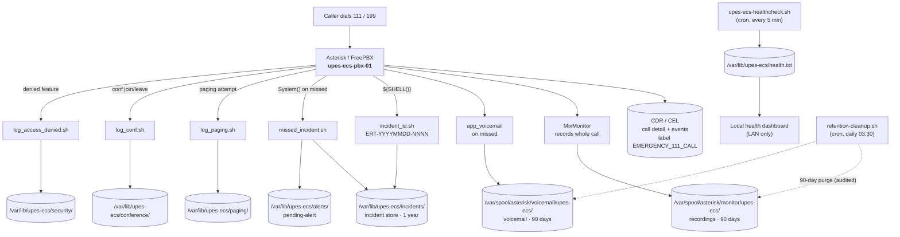

# UPES-ECS Numbering & Data Map

Two things in one place: **every number** the system uses, and **where every byte of
data lives** — its path, retention, and who may touch it. The authoritative source for
numbers is [SOP 01 Numbering Plan](../reference/numbering-plan.md); the data model comes
from [SOP 12](../operations/incident-logging-schema.md) and [SOP 13](../operations/recording-retention.md).
This document consolidates them for the engineer.

---

## 1. The consolidated numbering map

### 1.1 Emergency service codes

| Number | Name | Behaviour | Recorded | Phase |
|---|---|---|---|---|
| **111** | Campus Emergency Hotline *(primary)* | Human-first: record + incident ID → ERT queue (press **1** → first-aid) → on no-answer: offline panic-coach **in parallel with** background responder alert → retry / voicemail → Missed Incident | ✅ whole call | 1 |
| **102** | Offline panic-coach (`ctx_ai_helpline`) | Deterministic first-aid (CPR / bleeding / choking / fire / lockdown / recovery / trapped); **zero internet, zero AI service**; auto-fallback beneath 111, also direct-dial to test | ✅ (as 111) | 1 |
| **101** | AI Emergency Assistant *(local-first, planned)* | Local-first AI triage (Ollama/llama.cpp + Whisper + Piper — **no cloud**); always escalates / falls back to 111 + 102 coach | ✅ | 1.5 / 2 |
| **199** | Drill / Test line | Simulates 111; **no real dispatch**; `DRILL-ONLY` | ✅ (`DRILL_…`) | 1 |
| **198** | Echo / Audio test | Plays your audio back; mic/speaker check | ❌ | 1 |
| **196** | Internal AI test line | Tests the AI pipeline only | ❌ | 2 |
| 112 / 911 | Alias → 111 | **Only if UPES admin approves**; off by default | — | TBD |

> `101` is **never** an alias to `111` — it is the separate AI path.

### 1.2 Responder positions & fixed devices (4000–4999)

Positions are generic roles **staffed by shift**, never personal accounts
([SOP 30](../operations/ert-roles-and-shifts.md)). Confirmed positions in bold.

| Ext / Range | Role | Context | Answers 111 queue? |
|---|---|---|---|
| **4101** | ERT Lead / Incident Commander | `ctx_ert_lead` | escalation target |
| **4110 · 4111 · 4112** | ERT Operator positions (desks) | `ctx_ert` | ✅ queue member |
| **4113** | ERT Operator **reserve** (in 111 queue) | `ctx_ert` | ✅ queue member |
| **4120** | ERT Control Room | `ctx_control_room` | ✅ |
| 4114–4119 | Spare ERT operator positions | `ctx_ert` | ✅ (when staffed) |
| **4200** · 4201 · 4202 | Medical — dispatch + 2 seats | `ctx_responder` | ❌ dispatch target |
| **4300** · 4302 · 4303 | Security — dispatch + 2 seats | `ctx_responder` | ❌ dispatch target |
| **4301** | Security **Lead** | `ctx_responder_lead` | ❌ dispatch target |
| **4400** · 4401 · 4402 | Warden / Hostel — dispatch + 2 seats | `ctx_responder` | ❌ dispatch target |
| **4500** · 4501 · 4502 | Admin / Operations — dispatch + 2 seats | `ctx_responder` | ❌ dispatch target |
| **4600** · 4601 · 4602 | IT / Network — dispatch + 2 seats | `ctx_responder` | ❌ dispatch target |
| 4203–4299 · 4304–4399 · 4403–4499 · 4503–4599 · 4603–4699 | Spare department seats (within each block) | `ctx_responder` | ❌ (when staffed) |
| 4700–4799 | IP speakers / gate phones (fixed) | `ctx_fixed_device` | ❌ |

Every department follows one shape: a **dispatch front-door** (the round number — the
always-reachable seat and the 111 background-alert / backup target) plus **2 answer
seats**. Security also has a **Lead** (`4301`, `ctx_responder_lead`).

### 1.3 Paging zones (700–705)

Live voice broadcast; **restricted**; every attempt (allowed **and** denied) is logged.

| Code | Zone | Who may page |
|---|---|---|
| **700** | All-Campus Emergency Broadcast | ERT Lead **only** — **PIN required** |
| 701 | Academic Blocks | ERT Lead / Control Room |
| 702 | Hostels | ERT Lead / Warden-authorized |
| 703 | Security Gates | ERT Lead / Security Control |
| 704 | Medical / ERT Zone | ERT Lead / Control Room |
| 705 | Admin / Operations Zone | ERT Lead / Control Room |

### 1.4 Incident-command conference rooms (9000–9004)

Responder-only, PIN-protected; every join/leave logged.

| Room | Name | Recorded |
|---|---|---|
| **9000** | Main Incident Command Room (limit 20) | ✅ when activated for a real incident |
| 9001 | Security Coordination (limit 10) | ❌ default |
| 9002 | Medical Coordination (limit 10) | ❌ default |
| 9003 | Warden / Hostel Coordination (limit 10) | ❌ default |
| 9004 | Operations / Admin Coordination (limit 10) | ❌ default |

### 1.5 Feature codes

| Code | Action | Who |
|---|---|---|
| **`*45`** | Pause self from ERT emergency queue | ERT members (self) |
| **`*46`** | Resume into ERT emergency queue | ERT members (self) |

Pause affects **queue** calls only — a paused responder can still be dialed directly and
join conferences. ERT Lead may pause/resume others via admin action.

### 1.6 Human identity — SAP-ID formats

| Type | Format | Example | Default context |
|---|---|---|---|
| Student | 9-digit `5xxxxxxxx` | `500120597` (Rohan Batra) | `ctx_student` |
| Staff / faculty | 8-digit `4xxxxxxx` | `40000001` (Staff Member One) | `ctx_staff` |

`SIP extension = SIP username = SAP ID`. Caller ID renders `Name - SAP ID`. The **number
identifies the person**; the **context decides permissions**. SAP IDs are never reused.

### 1.7 Reserved / do-not-assign

`100` *(deprecated — removed, do not reassign)* · `101 · 196 · 198 · 199` (service codes) · `700–799` · `9000–9099` · `4000–4999` ·
`*45 · *46` — never assign to a user. Any SAP ID belongs to its owner only.

---

## 2. Data-flow — a call to where its bytes land



**ASCII fallback**

```text
Dial 111/199 ─► Asterisk/FreePBX (upes-ecs-pbx-01)
                 ├─ CDR/CEL ................ Asterisk store (1 yr)
                 ├─ MixMonitor ─► recordings /var/spool/asterisk/monitor/upes-ecs/ (90d)
                 ├─ voicemail ─► /var/spool/asterisk/voicemail/upes-ecs/ (90d)
                 ├─ incident_id.sh ─► /var/lib/upes-ecs/incidents/ (1 yr)
                 ├─ missed_incident.sh ─► incidents/ + alerts/
                 └─ log_paging/conf/access_denied.sh ─► /var/lib/upes-ecs/{paging,conference,security}/
   healthcheck.sh (5-min cron) ─► /var/lib/upes-ecs/health.txt ─► local dashboard
   retention-cleanup.sh (daily 03:30) ─► audited 90-day purge of recordings + voicemail
```

Helper scripts live in `/opt/upes-ecs/` and run as the `asterisk` user so the dialplan's
`System()`/`${SHELL()}` can write ([config/README.md](https://github.com/rohanbatrain/UPES-ECS/blob/main/config/README.md),
[setup.sh](https://github.com/rohanbatrain/UPES-ECS/blob/main/setup.sh)).

---

## 3. Where every byte lives

| Data type | Path / store | Retention | Who can access |
|---|---|---|---|
| Emergency recordings (111/199) | `/var/spool/asterisk/monitor/upes-ecs/` | **90 days** | ERT Lead · authorized Control-Room Admin · approved authority (all access **logged**) |
| Emergency voicemail | `/var/spool/asterisk/voicemail/upes-ecs/` | **90 days** | ERT Lead / Control Room (logged) |
| Conference 9000 recording (when active) | recordings store, linked to incident | 90 days | ERT Lead / authorized Admin |
| Incident / missed records | `/var/lib/upes-ecs/incidents/` | **1 year** | ERT (write initial) · ERT Lead / Admin (edit/close) |
| Pending alerts (missed) | `/var/lib/upes-ecs/alerts/` | 1 year | ERT / ERT Lead (review queue) |
| Access-denied events | `/var/lib/upes-ecs/security/` | 1 year | Admin / ERT Lead |
| Paging attempts (allowed + denied) | `/var/lib/upes-ecs/paging/` | 1 year | Admin / ERT Lead |
| Conference join/leave logs | `/var/lib/upes-ecs/conference/` | 1 year | Admin / ERT Lead |
| CDR / CEL (call detail + events) | Asterisk CDR (csv/db) | 1 year | Admin |
| Health status | `/var/lib/upes-ecs/health.txt` | live (overwritten) | Admin / dashboard (LAN) |
| Config (versioned) | git `upes-ecs-config` + FreePBX backup | **30 daily + 12 weekly** | Admin |
| Secrets (PINs, SIP secrets) | local secrets store / restricted include | n/a | Admin only — **never** committed to git |

**Principles baked in:** stored **locally** on university infra (no cloud, LAN-only);
recordings/voicemail **encrypted at rest** and in backup; audio auto-deletes at retention
unless flagged for preservation; **logs deliberately outlive audio** (1 year vs 90 days);
normal student-to-student calls are **CDR metadata only — never recorded, never an
incident**. Deletion requires ERT Lead + authorized university IT/admin approval.

> **TBD:** final **university retention policy** — the legal retention period (may extend
> beyond 90 days) and preservation/legal-hold process are for UPES administration to
> confirm ([SOP 13 §8](../operations/recording-retention.md)).

---

## 4. Incident record schema

Every 111 call creates an incident — including false alarms (closed as such). Asterisk
produces the raw telephony events; the **incident record** is what the ERT works from
([SOP 12](../operations/incident-logging-schema.md)).

### 4.1 IDs & filename convention

| Field | Format | Example |
|---|---|---|
| Incident ID | `ERT-YYYYMMDD-NNNN` | `ERT-20260704-0001` |
| Recording file | `ERT-YYYYMMDD-NNNN_CALLER-SAPID_YYYYMMDD-HHMMSS.wav` | `ERT-20260704-0001_500120597_20260704-143210.wav` |
| Call-log label | `EMERGENCY_111_CALL` (or `DRILL-ONLY` for 199) | — |

Audio, log, and voicemail all share the **one incident identity** — the ID is stamped on
the CDR `accountcode` and drives the recording filename.

### 4.2 Core fields

| Field | Notes |
|---|---|
| `incident_id` | `ERT-YYYYMMDD-NNNN` |
| `source_number` | 111 / 101 / 199 |
| `datetime` | Call start |
| `caller_sap_id` · `caller_name` · `caller_extension` | Identity (from directory) |
| `caller_device_ip` · `caller_role` · `caller_location` | Registered device/IP; student/staff/ert/fixed; stated or fixed location |
| `category` | Medical / Security / Fire-Smoke / Accident-Injury / Violence-Threat / Infrastructure / Hostel-Warden / Other |
| `answered_by` · `queue_wait` · `answer_time` | Responder identity; seconds in queue; time answered |
| `escalation_attempts` | Lead / backup attempt statuses |
| `dispatch_mode` · `dispatch_target` · `handoff_status` | none / dispatch-without-transfer / warm-transfer / three-way-bridge; team; Pending/Accepted/Failed/Completed/Escalated |
| `transfer_bridge_actions` · `incident_owner` | Timeline; ERT member who answered |
| `recording_path` · `voicemail_ref` | Link to WAV; same incident ID if applicable |
| `final_status` · `severity` · `notes` | see §4.4; Critical for missed else operator-set; ERT initial + Lead final |

**Mandatory before closure:** incident_id, datetime, caller SAP-ID + name, device/IP,
role, answered_by, queue_wait, answer_time, escalation_attempts, transfer/bridge actions,
**final_status**, notes, recording_path.

### 4.3 Missed Emergency Incident (extra fields)

Created when 111 is unanswered after escalation (or the caller hangs up early). **Never
auto-closes**; review within 5 minutes during active hours.

| Field | Value |
|---|---|
| `severity` | **Critical** (default) |
| `review_status` | **Pending Review** (default) |
| `voicemail_ref` | recording, or "none — early hangup" |
| `queue_attempt` / `escalation_attempt` | statuses |
| `callback_attempts` | mandatory when caller known |
| `grouping_key` | group repeats by **SAP ID + time window** |

### 4.4 Status values

- **Incident final:** `Answered · Escalated · Missed · Active Incident · Closed as False Alarm · Closed as Duplicate · Closed`
- **Missed review:** `Pending Review · Reviewed · Callback Attempted · Converted to Active Incident · Closed as Duplicate · Closed as False Alarm`
- **Handoff:** `Pending · Accepted · Failed · Completed · Escalated`

### 4.5 AI / 101 fields — **future (Phase 1.5 / 2)**

When `source_number = 101` and `ai_triage_enabled = true`, the record gains:
`ai_detected_location`, `ai_detected_category`, `ai_urgency_hint`, `ai_summary`,
`ai_questions_completed`, `transferred_to_111 (t/f)`, `transfer_time`,
`human_responder_answered (t/f)`, `human_override (t/f)`. The AI summary is a
**pre-brief only** — editable by ERT; **AI can never close an incident**.

---

## 5. Access-control summary

| Action | Who | Logged? |
|---|---|---|
| Write initial incident notes | ERT Operator | — |
| Edit notes / dispatch entries | ERT Lead / authorized Admin | — |
| **Close incident** | **ERT Lead / authorized Duty Officer only** | — |
| **Listen** to recordings / voicemail | ERT Lead · authorized Control-Room Admin · approved authority | ✅ who/when/which file |
| **Download** recordings | Authorized Admin / ERT Lead **only** | ✅ |

**Never allowed:** students, general staff, normal SIP users, unauthenticated users,
non-emergency roles. **All recording/voicemail access is itself logged** — least
privilege, time-limited by retention ([SOP 13 §4](../operations/recording-retention.md),
[SOP 12 §6](../operations/incident-logging-schema.md)). Full capability grid:
[SOP 04](../reference/sip-account-role-matrix.md).
