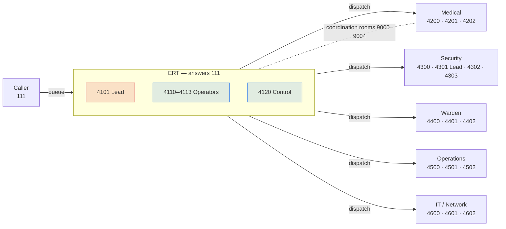

# UPES-ECS Responder Department Architecture & Live Map

How the responder departments are wired together, and how the Operations Console
renders them as a **real-time department map** during an emergency — a student calls,
a department position receives, and the map updates live as state changes.

Numbering authority: [SOP 01 Numbering Plan](../reference/numbering-plan.md) ·
Roles/shifts: [SOP 30](../operations/ert-roles-and-shifts.md) ·
Permissions: [SOP 04 Role Matrix](../reference/sip-account-role-matrix.md).

---

## 1. The shape of it

Every responder team is a **generic position staffed by shift** (never a personal SAP
ID). Each department mirrors one pattern: a **dispatch front-door** (the round number —
always reachable, the 111 background-alert / backup target) plus **answer seats**.
Security additionally has a **Lead**. Only **ERT** answers the 111 queue; the
departments are **dispatch targets**.

```text
                        ┌──────────────────────────────────────────┐
   Caller (student/     │            ERT — answers 111             │
   staff handset)  ───► │  4101 Lead · 4110–4113 Ops · 4120 Control │
   dials 111            │        (ctx_ert_lead / ctx_ert)          │
                        └───────────────┬──────────────────────────┘
                                        │ dispatch / warm-transfer / bridge (9000–9004)
        ┌───────────────┬───────────────┼───────────────┬───────────────┐
        ▼               ▼               ▼               ▼               ▼
   ┌─────────┐    ┌───────────┐   ┌───────────┐   ┌────────────┐  ┌────────────┐
   │ Medical │    │ Security  │   │  Warden   │   │ Operations │  │ IT/Network │
   │ 4200 D  │    │ 4300 D    │   │ 4400 D    │   │ 4500 D     │  │ 4600 D     │
   │ 4201 S1 │    │ 4301 Lead │   │ 4401 S1   │   │ 4501 S1    │  │ 4601 S1    │
   │ 4202 S2 │    │ 4302 S1   │   │ 4402 S2   │   │ 4502 S2    │  │ 4602 S2    │
   │         │    │ 4303 S2   │   │           │   │            │  │            │
   └─────────┘    └───────────┘   └───────────┘   └────────────┘  └────────────┘
     ctx_responder (all)  ·  Security Lead = ctx_responder_lead   (D = dispatch, S = seat)
```



---

## 2. The positions

| Department | Dispatch | Lead | Seats | Context | Answers 111? |
|---|---|---|---|---|---|
| **ERT** | — | 4101 | 4110 · 4111 · 4112 · 4113 · 4120 | `ctx_ert` / `ctx_ert_lead` / `ctx_control_room` | ✅ queue |
| **Medical** | 4200 | — | 4201 · 4202 | `ctx_responder` | ❌ dispatch target |
| **Security** | 4300 | **4301** | 4302 · 4303 | `ctx_responder` (+ `ctx_responder_lead` for 4301) | ❌ dispatch target |
| **Warden / Hostel** | 4400 | — | 4401 · 4402 | `ctx_responder` | ❌ dispatch target |
| **Operations** | 4500 | — | 4501 · 4502 | `ctx_responder` | ❌ dispatch target |
| **IT / Network** | 4600 | — | 4601 · 4602 | `ctx_responder` | ❌ dispatch target |

Spare seats live in each hundred-block (e.g. `4203–4299`); add them only when a shift
actually staffs them. Source of truth for accounts:
[`deploy/asterisk/pjsip_accounts.conf`](https://github.com/rohanbatrain/UPES-ECS/blob/main/deploy/asterisk/pjsip_accounts.conf) and
[`provisioning/responder-positions.csv`](https://github.com/rohanbatrain/UPES-ECS/blob/main/provisioning/responder-positions.csv).

---

## 3. The realtime map (Operations Console → **Department Map**)

The Console's **Department Map** view draws this topology and animates it live. It is a
data-driven SVG that re-reads status every 4 s (the same poll as the wallboard) — no
extra service, no cloud.

### 3.1 Data it reads

| Signal | Source (`/status` JSON) | Drives |
|---|---|---|
| Per-position registration/queue state | `presence[]` — `{ext, state}` | Node colour (ready / ringing / on-call / offline) |
| Live call legs | `liveCalls[]` — `{ext, cid, dialed, state, app, bridge, seconds}` | The animated **caller → responder** edges |
| Active call count | `activeCalls` | The "live now" counter + caller node |
| Queue answer points | `queueMembers[]` | ERT hub readiness |

`liveCalls[]` is parsed from `asterisk -rx "core show channels concise"` — see
[`api/upes_api.py`](https://github.com/rohanbatrain/UPES-ECS/blob/main/api/upes_api.py) `get_live_calls()` (live path) and
[`Console/Update-Status.ps1`](https://github.com/rohanbatrain/UPES-ECS/blob/main/Console/Update-Status.ps1) (static-snapshot fallback).
Two legs sharing a non-empty **bridge id** are talking to each other; the Console pairs
them into an edge. An unbridged leg dialing 111 is a caller still in the queue.

### 3.2 What you see, moment to moment

```text
student 111 ─(ringing, amber, animated)─►  ERT hub          responder still idle (green)
                          │ ERT answers, dispatches
student ───────(on-call, green, flowing)──────────────────►  Medical 4201  (node glows red = on call)
```

| State | Node | Edge |
|---|---|---|
| Idle / on shift | green outline | — |
| **Ringing** (receiving) | amber, pulsing | amber dashed, animated toward the node |
| **On call** (In use / bridged) | red glow | green, flowing dots caller → responder |
| Off shift / unreachable | grey, dimmed | — |

The map also lists each live call in words underneath —
`Rohan Batra (500120597) → Medical Resp 1 (4201) · on call 0:42` — so a control-room
operator reads the same truth as the picture. When there are no active calls it shows
the steady-state staffing (who is on shift in each department) so it is never blank.

### 3.3 Graceful degradation

- **Live API up** → true realtime (bridged caller↔responder edges, sub-4 s).
- **API down, static `status.json` only** → the map still colours every node from
  `presence[]` and lights ringing/on-call positions; caller edges appear when
  `liveCalls[]` is present in the snapshot.
- **No data at all** → nodes render in their known layout, greyed, with an "offline"
  banner — the topology is still legible.

---

## 4. Why this design

- **One picture, one truth.** The map is rendered from the *same* `/status` feed as
  every other Console view — nothing is mocked, so what the wall shows is what the PBX
  is doing.
- **Positions, not people.** Nodes are extensions (positions); the person on the seat
  comes from the shift log. A node lighting up means *that seat* is engaged, whoever is
  in it — exactly the accountability model in [SOP 30](../operations/ert-roles-and-shifts.md).
- **Department-shaped.** Grouping by department (with dispatch + seats + Security lead)
  means an incident commander sees at a glance which *team* is saturated, not just which
  extension is busy.

Related: [Blueprint 02 System Architecture](system-architecture.md) ·
[Blueprint 03 Call Flows](call-flows.md) ·
[Blueprint 06 Numbering & Data Map](numbering-and-data-map.md).
