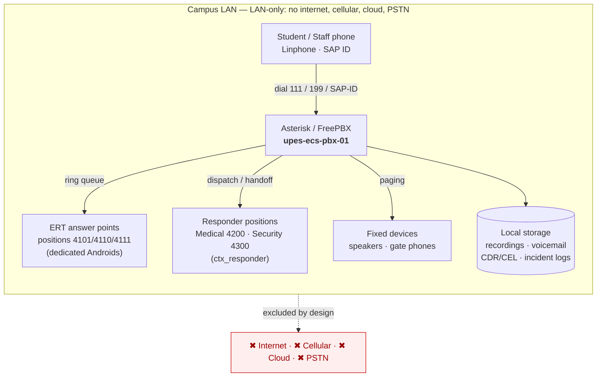
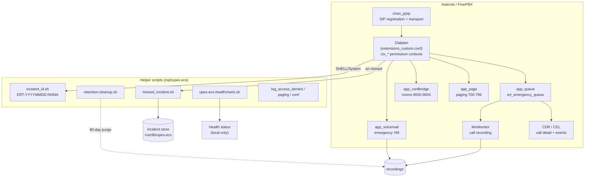
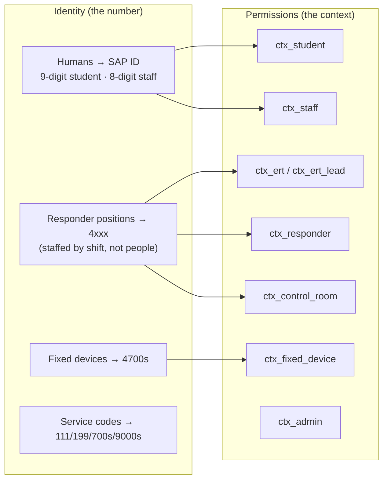
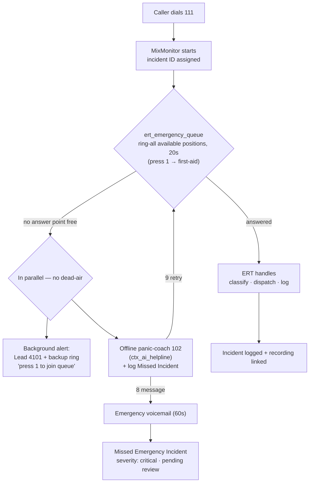
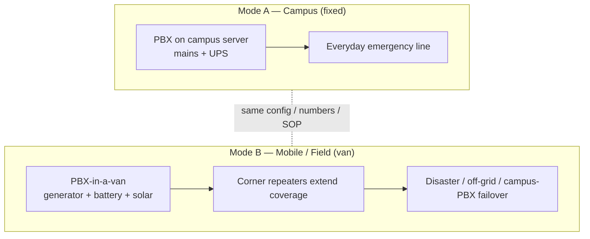

# UPES-ECS — System Architecture

In-depth architecture of the LAN-only emergency communication system: components,
identity model, permission model, storage, and deployment modes. Diagrams are Mermaid
with ASCII fallbacks.

---

## 1. System context (who talks to what)



**ASCII fallback**

```text
Student/Staff (Linphone, SAP ID) ─┐
ERT positions (4101/4110/4111) ───┤
Medical 4200 / Security 4300 ─────┼──► Asterisk/FreePBX (upes-ecs-pbx-01) ──► Local storage
Fixed devices (speakers/gates) ───┘        │
                                           └─ 111 / 199 / paging / conference
        ✖ no internet · ✖ no cellular · ✖ no cloud · ✖ no PSTN
```

---

## 2. Component architecture (inside the PBX)



**What each part does**

| Component | Role |
|---|---|
| **chan_pjsip** | SIP registration + signalling; enforces auth, LAN-only, per-endpoint context |
| **Dialplan / contexts** | The brain: routes 111/199, includes only the numbers each role may reach |
| **app_queue** | `ert_emergency_queue` — ring-all the available ERT *positions*, 20s |
| **MixMonitor** | Records the whole 111/199 call (not bridge-only) → WAV linked to incident ID |
| **app_voicemail** | Emergency voicemail when all responders miss |
| **app_confbridge** | Incident command rooms 9000–9004 (9000 recorded when active) |
| **app_page** | Live paging to zones 700–799 (PIN on all-campus 700) |
| **CDR/CEL** | Call detail + event logs; carry `EMERGENCY_111_CALL` / `DRILL-ONLY` labels |
| **Helper scripts** | Incident IDs, missed-incident records, health check, retention, access logs |

---

## 3. Identity & permission model

Two orthogonal ideas: **who you are** (the number) and **what you may do** (the context).



- **Humans use SAP ID** as extension + username. Same person, different job = same SAP ID, different context.
- **Responder roles are POSITIONS** (`4101`, `4110`, `4200`, …) staffed by trained
  officers per shift — never a personal account ([SOP 30](../operations/ert-roles-and-shifts.md)).
- **ERT positions answer the 111 queue**; `ctx_responder` (Medical/Security/…) are
  **dispatch targets**, not queue answerers.
- Full capability grid: [SOP 04](../reference/sip-account-role-matrix.md).

---

## 4. Emergency call path (logical)



Detailed sequence diagrams for every call type: [03-Call-Flows.md](call-flows.md).

---

## 5. Storage & data (where things live)

| Data | Location | Retention |
|---|---|---|
| Emergency recordings | `/var/spool/asterisk/monitor/upes-ecs/` | 90 days |
| Emergency voicemail | `/var/spool/asterisk/voicemail/upes-ecs/` | 90 days |
| Incident / missed records | `/var/lib/upes-ecs/incidents/` | 1 year |
| CDR / CEL | Asterisk CDR (csv/db) | 1 year |
| Access/paging/conf logs | `/var/lib/upes-ecs/{security,paging,conference}/` | 1 year |
| Health status | `/var/lib/upes-ecs/health.txt` | live |
| Config (versioned) | git `upes-ecs-config` + FreePBX backup | 30 daily + 12 weekly |

Full data map + incident schema: [06-Numbering-and-Data-Map.md](numbering-and-data-map.md).

---

## 6. Deployment modes



- **Mode A** — normal operation on the campus server.
- **Mode B** — self-powered van + rooftop repeaters for disasters or as **failover** for
  the campus PBX ([SOP 23](../guides/mobile-van-deployment.md)). Same config and numbers.
- Both are **LAN-only**. Multi-campus (Bidholi↔Kandoli) uses a rooftop wireless bridge
  ([SOP 20](../guides/multi-campus-wireless.md)).

Network topology detail: [04-Network-and-Deployment.md](network-and-deployment.md).

---

## 7. Design principles (the "why")

1. **LAN-only** — survives internet/cellular/cloud failure; the whole point.
2. **111 is human-first** — never depends on AI; AI (101) is a separate, later, always-falls-back-to-111 path.
3. **Positions, not people** — continuity through shift handover; no crisis-time provisioning.
4. **Record + log everything on 111** — accountability; student calls stay private.
5. **Least privilege by context** — emergency controls locked to emergency roles.
6. **Fixed answer points** — dedicated Androids (later IP phones) so answering never depends on a personal phone's battery.
7. **Provable** — the whole flow is testable via 199 and has been validated with real SIP/RTP.
