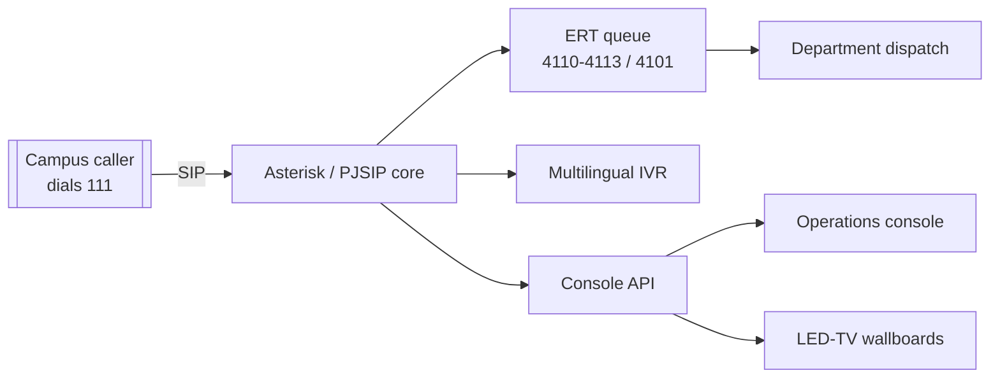

# UPES-ECS — Campus Emergency Communication System

**One number. Every emergency. No internet required.**

UPES-ECS is a LAN-first emergency communication system for a university campus. The
whole campus dials **one number — `111`** to reach a trained Emergency Response Team
(ERT), backed by an Asterisk/PJSIP call core, a live operations console, and always-on
LED-TV wallboards. It runs fully **air-gapped** on a single Windows laptop (QEMU VM) or
on Jetson hardware — no cloud, no external dependencies, no captured audio ever leaving
the box.

!!! tip "New here? Start with the quickstart"
    The fastest path from zero to a working demo is the
    [Day-1 quickstart](getting-started/quickstart.md).

## What it does

- **One-number hotline (`111`)** — the entire campus dials a single number; calls land in
  the ERT queue and are dispatched to the right responders.
- **ERT dispatch & escalation** — trained position logins (desk 4110–4113, lead 4101)
  answer, transfer, and escalate; unanswered calls trigger a callback/chase workflow.
- **Multilingual IVR** — per-caller voice language routing with generated Piper TTS
  prompts; the console and wallboards localize to the region language.
- **Live operations console** — a single-pane dashboard scaled to serve many concurrent
  screens, plus two always-on TV wallboards (safety + operations).
- **LAN-only by design** — an explicit infrastructure boundary; the system is built to
  operate with no internet and to keep all emergency data on-premises.

## How the docs are organised

| Section | For when you want to… |
|---|---|
| [Getting started](getting-started/index.md) | Stand the system up and go live |
| [Architecture](architecture/index.md) | Understand how the pieces fit together |
| [Features](features/index.md) | Read the capability-by-capability spec |
| [How-to guides](guides/index.md) | Perform a specific task (setup, provisioning, hardening) |
| [Operations](operations/index.md) | Run the system day to day (SOPs, runbooks, drills) |
| [Networking](networking/juniper.md) | Deploy onto Juniper campus network gear |
| [AI-101](ai-101/index.md) | The AI emergency assistant line |
| [Reference](reference/index.md) | Look up numbering, schemas, glossary |
| [Project](project/index.md) | Roadmap, status, and field-test learnings |

## System at a glance

!!! warning "Handling real data"
    This repository ships **sample** rosters and provisioning data (`*.example.*`).
    Real names, SAP IDs, SIP secrets, and captured audio must never be committed — see
    the [security policy](https://github.com/rohanbatrain/UPES-ECS/blob/main/SECURITY.md).
