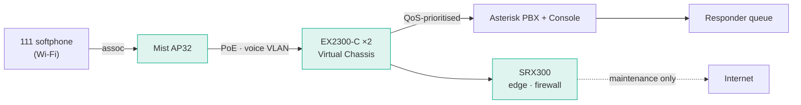

# Built on HPE Juniper Networking

> **On this campus, the network _is_ the `111` path.** When the internet, cellular, and the
> cloud are gone, the one number that matters keeps working — because it never left the
> local network in the first place.

UPES-ECS is a campus emergency communication system whose backbone is enterprise networking
infrastructure from **HPE Juniper Networking**. The gear below doesn't just carry traffic —
it powers the phones, prioritises the emergency call, and enforces the boundary that keeps
`111` alive when everything else fails. Presented at **HPE's Bangalore University Networking
Day** at UPES.

## The hardware, and what each piece does

-   :material-shield-lock:{ .lg .middle } __SRX300 / 320 — the guarded edge__

    ---

    One branch services gateway: firewall, DHCP, and the local NTP time source. It enforces
    the **LAN-only boundary**, so emergency traffic never leaves campus, and keeps the SIP
    signalling path clean (SIP ALG off, out of the media path).

    `8× GbE · zones · NAT · DHCP · NTP`

-   :material-lan:{ .lg .middle } __EX2300-C-12P ×2 — the voice fabric__

    ---

    Fanless PoE switches that **power and connect every phone, access point, and the PBX**.
    They carry the voice VLAN, give `111` priority with **CoS/QoS**, run as a **Virtual
    Chassis** (two switches, one logical device), onboard phones with **LLDP-MED**, and can
    **pinpoint a caller by switch port** (IP → MAC → port → room).

    `12× PoE+ · 124 W · 10G uplinks · Virtual Chassis`

-   :material-wifi:{ .lg .middle } __Mist AP32 ×2 — campus-wide reach__

    ---

    Wi-Fi 6 access points that carry the softphones dialing `111` — every corner of campus,
    entirely on the local network. A dedicated third radio and BLE add location and security
    scanning when cloud-connected.

    `Wi-Fi 6 · 4×4:4 · BLE + scanning radio`

## How a call travels — all on HPE gear

*AP = how students reach `111` over Wi-Fi · EX = powers, switches, and prioritises everything
· SRX = the guard at the edge.*

## Why enterprise networking is the differentiator

| Property | How the HPE infrastructure delivers it |
|---|---|
| **High availability** | Virtual Chassis + self-healing PoE (Junos `event-options` bounces a dead AP); redundant, resilient paths keep the hotline reachable. |
| **Low latency** | Local L2/L3 switching — every emergency call connects in an instant, no round-trip to a cloud. |
| **Complete local control** | The SRX enforces a LAN-only boundary; every packet stays on campus, under the operator's control. No internet, no cellular, no cloud dependency. |
| **Zero-touch onboarding** | LLDP-MED puts a phone on the voice VLAN with the right QoS the moment it's plugged in. |
| **Situational awareness** | Caller-location-by-switch-port turns the network into a locator: which port a `111` call came from maps to a physical room. |

## When networks fail, we don't

The core idea is simple: during an emergency, communication must not depend on external
internet connectivity or cellular availability. Built on reliable HPE networking
infrastructure, UPES-ECS keeps the campus talking — and the same architecture scales beyond a
single campus to universities, disaster-response sites, and any critical-communication zone
where reliability is essential.

---

**Go deeper:** the full engineering plan — every Junos/Mist feature, PoE budget, and the
air-gapped Mist commissioning workflow — is in the
[Juniper integration plan](../networking/juniper-integration-plan.md) and the
[live network discovery](../networking/juniper-live-discovery.md).
